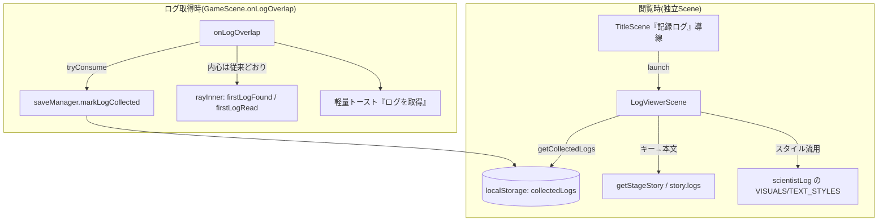

# 設計書

## アーキテクチャ概要

既存の疎結合構造を壊さず、変更を「ログ取得時の分岐」「Persistence への1フィールド追加」「新規 Scene 1枚」「タイトル導線」に閉じる。表示パイプライン(registry→UIScene→StoryOverlay)と `storyDirector.resolveStoryEvent` 本体は無変更。`StoryTextKind` から `scientistLog` は削除せず、閲覧画面でそのスタイルを流用する。



## コンポーネント設計

### 1. GameScene.onLogOverlap(改修)

**責務**: ログ取得を検出し、収集状態を保存・トーストを表示する。科学者ログ本文(`logFound`)を表示キューに積まない。

**実装の要点**:
- 現状(`src/scenes/GameScene.ts:197-211`):
  - 最初のログ: `inner(firstLogFound)` → `logFound` → `inner(firstLogRead)` を push。
  - 2本目以降: `logFound` のみ push。
- 改修後: `logFound` の push を両方とも除去し、`this.saveManager.markLogCollected(this.stageId, trigger.slot)` とトースト発火に置換。`inner(firstLogFound)` / `inner(firstLogRead)` は残す。
- `SaveManager` は `create()` で1インスタンス生成して保持し、取得のたびに `new` しない。GameScene が既に SaveManager を生成しているか確認し、なければフィールド追加。
- ⚠️ 最初のログでは本文が抜けて `firstLogFound`(誰かがいた) → `firstLogRead`(読んだ後)が直結する。文意が不自然でないか実装時に確認し、違和感があれば監督に相談(テキスト自体は変更しない方針)。

### 2. Persistence: SaveData 拡張 + マイグレーション(改修)

**責務**: ログ収集状態を永続化し、旧バージョンセーブとの互換を保つ。

**実装の要点**:
- `src/types/save.ts`: `SaveData` に `collectedLogs: string[]` を追加。
- `src/config/storageKeys.ts`: `SAVE_VERSION` 2→3。コメントに `v3: collectedLogs 追加` を追記。
- `src/persistence/SaveManager.ts`:
  - `defaultSaveData()` に `collectedLogs: []` を追加。
  - `getData()` / `save()` のディープコピーに `collectedLogs: [...]` を追加。
  - `isValidSaveData()` に `isStringArray(d.collectedLogs)` 検証を追加。
  - `markLogCollected(stageId, slot)` / `getCollectedLogs(): string[]` を追加。キーは `${stageId}:${slot}`。重複は追加しない。
  - **🚨 最重要**: `migrate()` は現状 v1 専用。SAVE_VERSION を 3 にすると **v2 セーブ(version:2)が `isValidSaveData` で弾かれ migrate でも拾えず defaultSaveData に落ち、既存の clearedStages が消える**。これを防ぐため migrate に v2→v3 分岐を追加する:
    - `d.version === 2` かつ `isStringArray(d.clearedStages)` を満たすなら、`collectedLogs: []` を補完し他フィールドはそのまま引き継いで version:3 を返す。
    - bestTimeMs / settings の検証も既存ヘルパで実施し、不正時は既定へフォールバック(throw しない方針厳守)。

### 3. ログ取得トースト(新規・軽量UI)

**責務**: 拾得時に「ログを取得」を短時間表示して取得フィードバックを与える。

**実装の要点**:
- `StoryOverlay` のキューには乗せない別系統。HUD 隅に配置、約1.2秒で自動消去(`time.delayedCall` + フェード)。
- ゲームを pause しない。連続取得時は短時間なので素直に上書き表示。
- 設置場所は UIScene 内の軽量メソッド or `src/ui/` の小コンポーネント。既存 HUD レイアウト規約(`scale.width/height`, controlBand)に乗せる。

### 4. LogViewerScene(新規 Scene)

**責務**: 取得済みログ一覧と本文を1画面で表示し、閉じる。

**実装の要点**:
- `CutsceneScene` の「launch して閉じる」作法を雛形にする。呼び出し元非依存に作り、将来ゲーム中からも開けるようにする。
- 構成: 左に slot 単位の一覧(全ステージ分を順序固定で列挙)、右(または下)に選択ログ本文。
- 未取得は行を出しつつ「???」でロック表示(本文は取得済みのみ)。slot 名は出さない(ネタバレ防止)。
- 本文は二重保存しない: `getCollectedLogs()` のキーから `getStageStory(stageId).logs[slot]` を引いて表示。
- `scientistLog` の `VISUALS`/`TEXT_STYLES`(暖色・serif)を流用して世界観を統一。
- 全ログ一覧の母集合は `STAGE_IDS` × 各 `story.logs` のキーから算出(取得済みフラグと突き合わせ)。

### 5. タイトル導線(改修)

**責務**: タイトルから LogViewerScene を開く。

**実装の要点**:
- `src/scenes/TitleScene.ts` の DEV MODE ボタンと同じ作法で「記録ログ」ボタンを追加し、`scene.launch(SCENE_KEYS.logViewer)` または遷移。
- `src/config/sceneKeys.ts` に `logViewer` キー追加。`src/config/gameConfig.ts` の scene 配列に LogViewerScene を登録。

## データフロー

### ログ取得時
```
1. プレイヤーが LogTrigger に接触 → onLogOverlap
2. trigger.tryConsume() で一度きり確認
3. saveManager.markLogCollected(stageId, slot) で collectedLogs に追記・保存
4. 「ログを取得」トーストを表示(自動消去)
5. 最初のログなら inner(firstLogFound)→inner(firstLogRead) を従来どおり表示
   (科学者ログ本文 logFound は push しない)
```

### ログ閲覧時
```
1. タイトルで「記録ログ」を選択 → LogViewerScene を launch
2. getCollectedLogs() で取得済みキー集合を取得
3. STAGE_IDS × story.logs のキーで全ログ母集合を構築
4. 取得済みは本文(story.logs[slot])を、未取得は「???」を一覧表示
5. 一覧から選択して本文を表示。閉じるとタイトルへ
```

## エラーハンドリング戦略

- localStorage 不可/破損: 既存どおり throw せず既定値で継続(`SaveManager.load`/`save` の try/catch を踏襲)。
- 未知の version / 破損データ: migrate で拾えなければ defaultSaveData にフォールバック。v2 は必ず救済する。
- `story.logs[slot]` が存在しない取得キー(データ不整合): 閲覧画面では当該行をスキップ or 「???」扱いにし、throw しない。

## テスト戦略

### ユニットテスト
- `SaveManager`:
  - **v2→v3 マイグレーション**: version:2 + clearedStages/bestTimeMs/settings を持つデータを読み込むと、clearedStages 等が維持され `collectedLogs: []` が補完される(進捗が消えないことを実値で検証)。
  - `markLogCollected` で collectedLogs にキーが追加され、重複追加されない。
  - `getCollectedLogs` が保存値を返す。
  - localStorage 例外時に throw せず既定値になる(既存テスト方針踏襲)。
  - v1 セーブの既存マイグレーションが引き続き通る(回帰防止)。
- `isValidSaveData`: collectedLogs 欠落/非配列を弾く・正常を通す。
- 閲覧用ロジック(純粋関数として切り出せる部分): 取得済み/未取得の振り分け、母集合構築。

### 統合・回帰
- 既存の `storyData.test.ts` / `coreBoss.test.ts`(logs・logTriggers 検証)が引き続き通る(logs 自体は削除しないため通る想定)。
- `npm test` / `lint` / `typecheck` / `build` 一式。

## 依存ライブラリ

新規追加なし(Phaser 既存機能のみ)。

## ディレクトリ構造

```
src/
├── types/save.ts                 # 改修: SaveData.collectedLogs 追加
├── config/storageKeys.ts         # 改修: SAVE_VERSION 2→3
├── config/sceneKeys.ts           # 改修: logViewer キー追加
├── config/gameConfig.ts          # 改修: LogViewerScene 登録
├── persistence/SaveManager.ts    # 改修: 収集 API + v2→v3 マイグレーション
├── scenes/GameScene.ts           # 改修: onLogOverlap(本文除去・保存・トースト)
├── scenes/LogViewerScene.ts      # 新規: ログ閲覧画面
├── scenes/TitleScene.ts          # 改修: 「記録ログ」導線
└── ui/(トースト)                  # 新規 or UIScene 内: 取得トースト
tests/unit/persistence/           # 追加: SaveManager v2→v3・収集 API
```

## 実装の順序

1. Step1: `onLogOverlap` から科学者ログ本文表示を除去(渋滞解消・最小変更)
2. Step2: SaveData 拡張・SAVE_VERSION 3・収集 API・v2→v3 マイグレーション + テスト
3. Step3: 取得トースト
4. Step4: LogViewerScene
5. Step5: タイトル導線・sceneKeys/gameConfig 登録
6. 品質チェック(test/lint/typecheck/build)

各 Step は独立して価値を持ち、途中で止めても壊れない順序。

## セキュリティ考慮事項

- localStorage に保存するのは取得フラグ(ステージ:スロットのキー文字列)のみ。機密情報・URL・シークレットは扱わない。
- 本文はソース内(`config/story/`)に既存。セーブへ二重保存しない。
- コミット前にクルトワ(security-engineer)のレビューを実施(ハードコーディング観点含む)。

## パフォーマンス考慮事項

- SaveManager は GameScene で1インスタンス保持し、取得ごとの `new`/再ロードを避ける。
- トーストは軽量実装、毎フレーム生成しない。

## 将来の拡張性

- LogViewerScene を呼び出し元非依存に作るため、後からゲーム中 HUD ボタン + pause で開く導線(スコープ外)を追加しやすい。
- `collectedLogs` はキー文字列配列なので、将来ログ種別が増えても構造変更不要。
