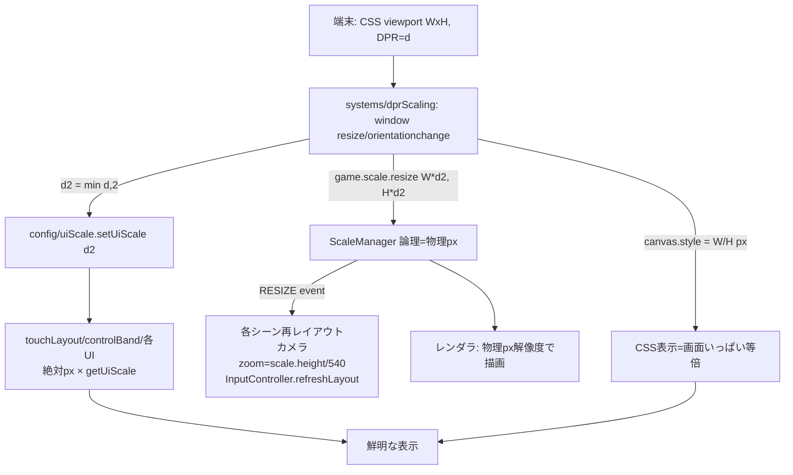

# 設計書

## アーキテクチャ概要

「論理サイズ＝物理ピクセル化」＋「画面座標系の絶対px を単一の uiScale でスケール」の2本立て。
Phaser 3.90 では `resolution` が 1 固定でバッキング解像度は論理サイズと一致するため、鮮明化＝論理サイズの物理px化が唯一の正攻法。これに伴う「絶対pxが縮む」問題を uiScale ヘルパーで一括補正する。



## コンポーネント設計

### 1. config/uiScale.ts（新規・Phaser非依存）

**責務**:
- 現在の UI スケール係数 `uiScale` を保持・取得・設定する単一の真実源
- `devicePixelRatio` の上限キャップ算出

**実装の要点**:
- `cappedDpr(raw = window?.devicePixelRatio ?? 1): number` … `max(1, min(raw, 2))`。test/SSR で window 不在でも 1 に落ちる。
- `getUiScale(): number` / `setUiScale(scale: number): void`（モジュールローカル変数、初期値1、下限1でガード）
- `scaled(px: number): number` … `px * getUiScale()`（絶対px → 物理px）
- `scaledFontPx(px: number): string` … `` `${scaled(px)}px` ``（fontSize文字列用）
- Phaser に依存しない純関数群（ユニットテスト容易）

### 2. systems/dprScaling.ts（新規・Phaser依存）

**責務**:
- canvas のバッキング解像度を物理px化し、CSS表示サイズを画面いっぱいに保つ
- DPR/uiScale の初期化とリサイズ追従

**実装の要点**:
- `initHiDpiScaling(game: Phaser.Game): void`
  - `apply()`: `const d = cappedDpr(); setUiScale(d);` → `game.scale.resize(innerWidth*d, innerHeight*d)` → `canvas.style.width/height = innerWidth/innerHeight px`
  - 初回 `apply()` 実行、`window` の `resize` / `orientationchange` に `apply` を登録
- `game.scale.resize()` が RESIZE イベントを発火するため、既存の各シーンの再レイアウト（GameScene.applyCameraLayout, InputController.refreshLayout, GameScene.setupOrientationHandling）はそのまま動作する

### 3. config/gameConfig.ts（変更）

**責務**: scale モードを `RESIZE` → `NONE` に変更（自前で resize を制御）

**実装の要点**:
- `scale.mode: Phaser.Scale.NONE`、`autoCenter: NO_CENTER` は維持、初期 width/height は GAME_WIDTH/HEIGHT（直後に dprScaling が上書き）
- `render` は `antialias: true` 維持（高解像度バッキングと相性良）。`roundPixels` は導入しない（カメラ追従のジッタ回避、必要なら後追い）
- コメントを「NONE + 自前DPR resize」前提に更新

### 4. main.ts（変更）

**責務**: Game 生成直後に `initHiDpiScaling(game)` を配線

**実装の要点**:
- `new Phaser.Game(...)` の直後（最初のシーン create より前）に同期実行 → 全シーンの create 時点で uiScale 確定を保証

### 5. config/touchLayout.ts / controlBand.ts（変更）

**責務**: 画面座標系の絶対px定数を `getUiScale()` 倍に

**実装の要点**:
- `BUTTON_RADIUS`・配置オフセット(84/112/188/200/72)・`BAND_BUTTON_MARGIN_PX`・`MOVE_DEADZONE_PX`・`CLIMB_DEADZONE_PX`・`MOVE_PAD_BASE/STICK/MAX_RADIUS` を消費時に `scaled()` で乗算
- `controlBandHeight` の `CONTROL_BAND_MIN_PX/MAX_PX` クランプを `scaled()` 倍（比率 `RATIO` は screenHeight が物理px化されるので自動スケール）
- エクスポート定数は「ベース値（CSS px）」のまま維持し、関数内で乗算 → 既存テストはデフォルト1で不変

### 6. 各UI（変更）

**責務**: fontSize と絶対px を `scaledFontPx()` / `scaled()` 経由に

**対象**: TitleScene, PreloadScene, GameOverScene, ClearScene, CutsceneScene, OrientationScene, ui/StoryOverlay, ui/MovePad, ui/TouchControls, ui/LifeBar, ui/BossHpBar, ui/ChargeGauge, devMode/stageSelect

**実装の要点**:
- `fontSize: '48px'` → `fontSize: scaledFontPx(48)`、`setFontSize(style.fontSize)` 系も同様
- 矩形/線/オフセット等の絶対px → `scaled()`
- 位置の比率（`width/2`）は変更しない

## データフロー

### 起動〜表示
```
1. main.ts: new Phaser.Game(config[mode=NONE])
2. main.ts: initHiDpiScaling(game) → cappedDpr算出 → setUiScale(d) → scale.resize(物理px) → canvas.style=CSS px
3. 各シーン create: getUiScale() 確定済み → scaledFontPx/scaled で物理px換算してUI生成
4. レンダラが物理px解像度で描画 → CSS表示は画面いっぱい → 鮮明
```

### リサイズ/回転
```
1. window resize/orientationchange → dprScaling.apply()
2. scale.resize(新物理px) → RESIZE event
3. GameScene.applyCameraLayout（zoom再計算）/ InputController.refreshLayout / orientation check が追従
```

## テスト戦略

### ユニットテスト（ギュレル / test-engineer）
- `config/uiScale`: cappedDpr の境界（0.5/1/2/3 → 1/1/2/2）、getUiScale/setUiScale、scaled/scaledFontPx
- `config/touchLayout`: uiScale=2 でボタン半径/オフセット/不感帯が2倍になること（既存の uiScale=1 ケースは不変）
- `config/controlBand`: uiScale=2 で MIN/MAX クランプが2倍、RATIO 部は物理px入力でスケールすること
- 各テストで `setUiScale` を beforeEach/afterEach で初期化し副作用を残さない

### 統合テスト（E2E / Playwright）
- 既存 `orientation/fill-screen.spec.ts`・`play-through/*` をそのまま流して回帰検出
- 追加: `deviceScaleFactor: 2/3` のコンテキストで、`canvas.width >= cssWidth*1.9` かつ `canvas.style.width == cssWidth px`、ゲーム進行（player.x 増加）が成立することを assert

## セキュリティ考慮事項

- 外部入力・ネットワークなし。`window.devicePixelRatio`/`innerWidth` を読むのみ。ハードコードURL/シークレットの追加なし。
- コミット前にクルトワ（security-engineer）レビューを実施。

## パフォーマンス考慮事項

- DPRキャップ2でフィルレート負荷を抑制（DPR3端末で 2.25倍→1倍）。Arcade物理はCPU側で解像度非依存。
- resize ハンドラは回転/リサイズ時のみ発火。常時負荷なし。

## 将来の拡張性

- アセットの高解像度差し替え時も uiScale 基盤はそのまま活用可能
- DPRキャップ値を設定化したくなった場合 `cappedDpr` の上限を一箇所変更で済む
