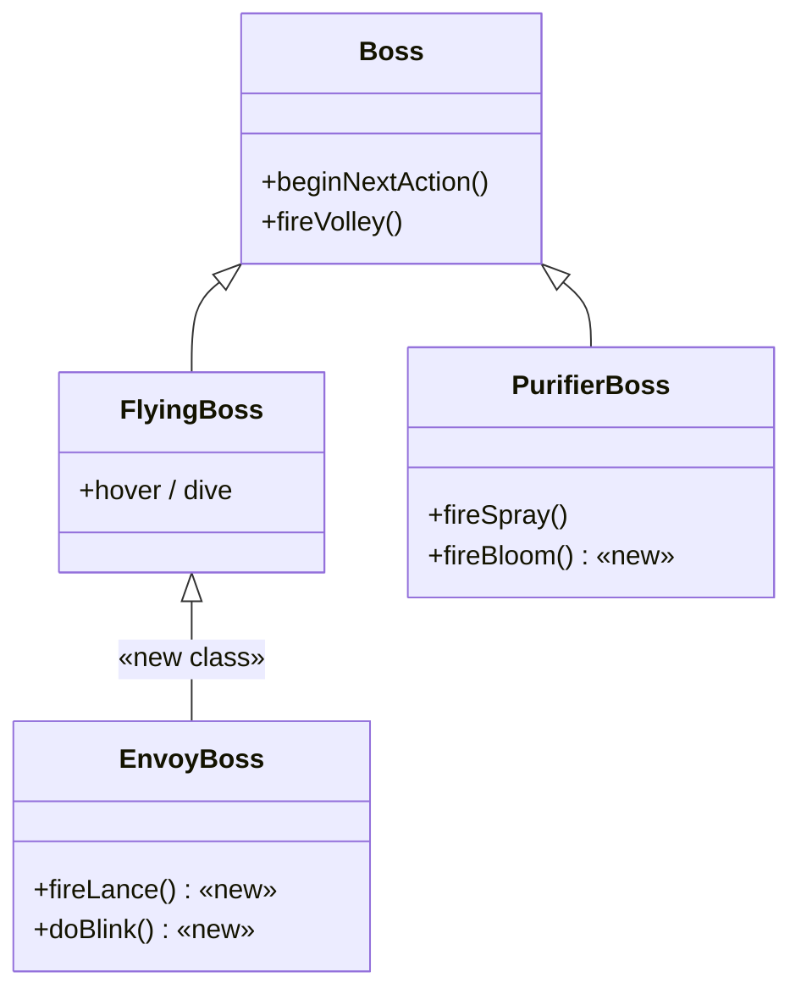

# 設計書

## アーキテクチャ概要

既存のボス拡張パターン（`Boss`/`FlyingBoss` を継承し `beginNextAction` を override して固有アクションを足す）を踏襲する。行動ロジックは `bossAi.ts` の系統別 `PhaseWeights` + `pickNext*BossAction` 関数で増設し、ビジュアルは `characterRig.ts` の `RigSpec` を追加する。値は全て `balance.ts` に集約する。



## コンポーネント設計

### 1. EnvoyBoss（Stage 5・新規クラス）

**責務**:
- `FlyingBoss` を継承し、飛行ボスの滞空・急降下を再利用しつつ、固有アクション `blink`・`lance` を実装する
- ENVOY 専用の行動抽選（`pickNextEnvoyBossAction`）を用いる

**実装の要点**:
- `blink`: プレイヤーの逆サイドへ短距離ダッシュ（`blink.dashSpeed`）。移動中は `setAlpha` による残像表現。phase2 では `blink` 後に即 `lance` する連携が増える
- `lance`: 滞空位置からプレイヤー狙いの高速槍弾を時間差で複数発射（`lance.countP1/P2`, `intervalMs`, `speed`）。新弾種 `lance`（`ProjectileKind`）で見た目を差別化。**初版は非貫通**
- `blink`/`lance` は `ENVOY_WEIGHTS` に閉じ、他系統の抽選に混入させない（テストで担保）

### 2. PurifierBoss（Stage 4・既存拡張）

**責務**:
- 既存の `fireSpray` に加え、`fireBloom`（動的汚染床生成）を実装する
- `bloom` を含む改訂版 `PURIFIER_WEIGHTS` で抽選する

**実装の要点**:
- `bloom`: プレイヤー足元〜周辺の地面に時限式の汚染パッチ（動的 HAZARD）を生成。`bloom.countP1/P2`, `patchWidthP1/P2`, `lifespanMsP1/P2`, `damage`
- **動的 Hazard 生成の責務は GameScene 側に置く**。`CoreBoss.setSummonContext` と同型で、GameScene が hazard グループ/生成関数を `PurifierBoss` にコンテキスト注入する（ボスが Scene の Hazard 構築を直接触らない疎結合を維持）
- phase2 で設置枚数増・存続時間延長 → 床がほぼ常設化し、位置取りとジャンプを強制

### 3. bossAi.ts（行動抽選の拡張）

**責務**:
- `PURIFIER_WEIGHTS` に `bloom` を追加（改訂）
- `ENVOY_WEIGHTS` + `pickNextEnvoyBossAction` + `allowedEnvoyActions` を新設

**重みテーブル設計**:
```
PURIFIER_WEIGHTS（改訂）
  phase1: { move: 25, shoot: 20, spray: 25, bloom: 25, idle: 5 }
  phase2: { move: 20, shoot: 15, spray: 30, bloom: 35 }

ENVOY_WEIGHTS（新設）
  phase1: { hover: 10, dive: 20, lance: 35, blink: 25, shoot: 10 }
  phase2: { hover: 5,  dive: 20, lance: 35, blink: 35, shoot: 5 }
```

### 4. characterRig.ts（専用ビジュアル）

**bossPurifier**:
- シルエット: 背中に巨大な汚染タンクを背負った接地機。戦闘用ヘルメット+キャノンの `'boss'` とは別人格
- パーツ: 太短脚（leg）、幅広 torso（roundedBox）、背面タンク（roundedBox 縦長・z最背面）、低い作業頭（sensor/dome）、散布ノズル（cannon/barrel）
- 色: 浄化を装う白緑 × 漏出する毒の黄緑。汚染弾/Hazard(0xaef03a)と地続き
  ```
  purifier: { metal: 0x1a2410, base: 0x2e4a1c, light: 0x6e8a3a, accent: 0xaef03a, accent2: 0xd8f0a0 }
  ```

**bossEnvoy**:
- シルエット: スリムな槍／矢じり型の流線機体。前傾の鋭角。`bossFlying`（単眼+ウィング）と別物
- パーツ: 後退翼（roundedBox 細）、紡錘形 core、前方に突き出た槍（barrel）、鋭い単眼（cyclops）
- 色: 冷たい白青 × 警告の紫赤。stage5背景(0x0c1119)・ラスボスphase2眼(0xff5a5a)と接続
  ```
  bossEnvoy: { metal: 0x0a1420, base: 0x16304a, light: 0x3a6a9a, accent: 0x8ad8ff, accent2: 0xff5a8a }
  ```
- **新 PartShape は極力作らず、既存 shape（roundedBox/barrel/cyclops/leg）の組み合わせで実現**（`makePart` switch 拡張の描画リスクを回避）
- UI/描画の px は高DPI規約に従い、リグの寸法系は既存リグと同じ仕組み（`RIG_BODY_SIZE` 等）に乗せる

## balance.ts パラメータ設計

### PURIFIER（改訂）
- `maxHp: 28`（序列維持）, `width: 96, height: 92`（タンク背負いで大型化）
- `actionDurationMs.bloom: 1100`（設置の溜め）
- `spray` 据え置き（count:5, spreadRad: π/2, speed:200）
- `bloom: { patchWidthP1:90, patchWidthP2:130, countP1:1, countP2:2, lifespanMsP1:3500, lifespanMsP2:5000, damage: HAZARD.pollutionDamage }`
- `PurifierBossConfig` に `bloom` フィールドを追加

### ENVOY（改訂）
- `maxHp: 26`（序列維持）, `width:60, height:52`（スリム据え置き）
- `actionDurationMs.lance: 550, blink: 450`
- `lance: { countP1:2, countP2:3, speed:420, intervalMs:110 }`
- `blink: { dashSpeed:520, afterimageMs:200 }`
- `EnvoyBossConfig extends FlyingBossConfig` を新設し `lance`/`blink` を追加

## データフロー

### Stage 4 bloom（汚染床設置）
```
1. PurifierBoss.beginNextAction で bloom が抽選される
2. fireBloom() が GameScene 注入の生成関数を呼ぶ（プレイヤー座標を渡す）
3. GameScene が動的 Hazard を生成・当たり判定登録・タイマー登録
4. lifespan 経過で Hazard を破棄
```

### Stage 5 lance（高速狙撃）
```
1. EnvoyBoss.beginNextAction で lance が抽選される
2. fireLance() が intervalMs 間隔で countP1/P2 本の lance 弾をプレイヤー方向へ発射
3. 各弾は projectile(lance) として CombatSystem の既存衝突解決に乗る（非貫通）
```

## テスト戦略

### ユニットテスト（Phase A で先行 / Red-Green）
- `bossAi`: `pickNextEnvoyBossAction` が `ENVOY_WEIGHTS` の許可アクションのみ返す
- `bossAi`: `blink`/`lance`/`bloom` が他系統（FLYING/GROUND/WARDEN）の抽選に混入しない（封じ込め）
- `bossAi`: 改訂 `PURIFIER_WEIGHTS` に `bloom` が含まれ、phase2 で重みが増える
- 既存 `envoyBoss`/`purifierBossAi` テストの改訂（FLYING共有前提の比較を独立化）

### 統合・動作確認
- Stage 4/5 を実際にプレイし、新アクションとリグが想定通り発火・表示されるか
- HP序列・難易度カーブが破綻していないか

## ディレクトリ構造（変更ファイル）

```
src/types/boss.ts            … BossAction に bloom/lance/blink 追加
src/types/combat.ts          … ProjectileKind に lance 追加
src/config/balance.ts        … PurifierBossConfig 拡張 / EnvoyBossConfig 新設 / 値改訂
src/systems/bossAi.ts        … PURIFIER_WEIGHTS 改訂 / ENVOY_WEIGHTS 新設 / 抽選関数
src/systems/shot.ts          … lance 弾の spec 分岐（必要に応じて）
src/entities/PurifierBoss.ts … fireBloom() 追加 / hazard コンテキスト注入
src/entities/EnvoyBoss.ts    … 新規クラス（fireLance / doBlink）
src/entities/Projectile.ts   … lance テクスチャ分岐
src/config/characterRig.ts   … bossPurifier / bossEnvoy リグ追加
src/config/assetKeys.ts      … パーツキー / projectileLance テクスチャキー追加
src/scenes/PreloadScene.ts   … projectileLance 描画（新 shape 時のみ makePart 拡張）
src/scenes/GameScene.ts      … spawnBoss で EnvoyBoss 生成 / Purifier に hazard 注入
src/config/stage1.ts         … Stage4 bossRig:'bossPurifier' / Stage5 bossRig:'bossEnvoy'
tests/unit/**                … 既存テスト改訂 + 新規テスト
```

## 実装の順序（リスク順に隔離）

1. **Phase A（土台・低リスク）**: 型定義 → balance 値 → bossAi 重みテーブル/抽選関数。純粋ロジックをテスト先行（Red-Green）。ENVOY 封じ込めテストを通す
2. **Phase B（ENVOY メカニクス）**: `EnvoyBoss` 新クラス + `lance` 弾（非貫通）+ `blink`。GameScene 差し替え。ビジュアルは一旦 `bossFlying` 流用のまま検証
3. **Phase C（ENVOY ビジュアル）**: `bossEnvoy` リグ追加。stage1.ts で bossRig 指定
4. **Phase D（PURIFIER bloom）**: 最大リスク。先に `Hazard.ts`/`buildHazards` を精査 → 動的生成方式を確定 → `fireBloom` + コンテキスト注入
5. **Phase E（PURIFIER ビジュアル）**: `bossPurifier` リグ追加。placeholder 解消
6. **Phase F（仕上げ）**: 難易度カーブ通し調整、全テスト/lint/typecheck/build

## パフォーマンス考慮事項

- 動的 Hazard（bloom）は時限破棄を確実に行い、オブジェクトリークを防ぐ。可能ならプール化を検討
- 残像（blink）は短命の Graphics/Sprite で、毎フレーム生成しすぎない

## セキュリティ考慮事項

- 外部入力・ネットワーク・シークレットを扱わないクライアント内ロジックの変更のため、該当リスクは限定的
- コミット前にクルトワ（security-engineer）レビューを実施（ハードコーディング観点含む）

## 将来の拡張性

- `bloom` の動的 Hazard 生成基盤は、他ステージのギミック（時限床等）にも再利用可能
- `lance` 弾の貫通挙動は `ProjectileKind` 拡張で後段追加できる
