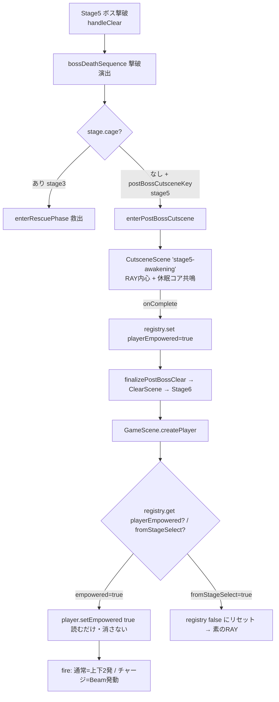

# 設計書

> 本設計は architecture-designer（バルベルデ）による2回の設計レビューで確定したもの。確定済みの監督判断（強化の源=案A、リトライ維持、ビーム=持続レーザー、発動中移動可、威力≒3）を反映する。

## アーキテクチャ概要

既存パターンを最大限尊重し、最小・非破壊で拡張する。

- **強化状態の保持**: Phaser `game.registry`（ゲーム全体スコープ・セーブ非保存）の揮発フラグ `PROGRESS.playerEmpowered`。
- **通常2発**: `Player.fire()` を多弾ループ化（既存の `Projectile` プール・velocityY 対応をそのまま利用）。
- **ビーム**: 新規 `Beam` エンティティ（`Phaser.GameObjects.Rectangle` 継承）。`Projectile`（飛んで命中で消える弾）の不変条件を壊さないため別エンティティに分離。当たり判定はハザード床と同じ Rectangle ネイティブサイズ方式（body膨張の罠を回避）。
- **演出組み込み**: Stage3の救出フローを cage 非依存に一般化し、Stage5の `postBossCutsceneKey: 'stage5-awakening'` を流す。カットシーン完了時に強化フラグを付与。



## コンポーネント設計

### 1. 強化状態フラグ（registry）

**責務**:
- Stage5正規クリアの強化を Stage6 プレイ系列（リトライ含む）の間だけ保持する。
- 単体選択・全クリア後の次プレイに漏らさない。

**実装の要点**:
- `src/config/registryKeys.ts` に `PROGRESS.playerEmpowered = 'progress.player.empowered'` を追加（セーブ非保存）。
- **付与**: `finalizePostBossClear`（Stage5演出 onComplete）で `registry.set(true)`。
- **参照（消費しない）**: `GameScene.createPlayer()` で `registry.get() === true` を読み `player.setEmpowered(true)`。**削除しない**ことがリトライ維持の核。
- **隔離**: `GameSceneData.fromStageSelect?: boolean` を追加。タイトル発の game 起動（START／ステージ選択）には `fromStageSelect: true` を渡し、`GameScene.init` で true のとき `registry.set(false)`。継続（ClearScene）・リトライ（GameOverScene）には付けない。
- **最終クリア**: `finalizeEnding`（全クリア）で `registry.set(false)`。
- これにより「正規クリア→リトライ維持／単体選択→素／全クリア後の漏れなし」を `init`（fromStageSelect）と `finalizeEnding` の2点で必要十分にカバーする。

### 2. Player の強化挙動

**責務**:
- 強化状態を保持し、`fire()` の挙動を分岐する。

**実装の要点**:
- `Player` に `private empowered = false` と `setEmpowered(v: boolean)` を追加。
- `beams?: Phaser.GameObjects.Group` と `setBeams()`、`beamActiveUntil: number` を追加。
- `fire(action, now)` の分岐:
  - `empowered && action === 'normal系'` → 上下2発（角度 `±SHOT.splitAngleRad`、`Math.cos/sin` で vx/vy 分配、`Projectile.fire` の velocityY 利用）。
  - `empowered && action === 'fireCharged'` → **Beam 発動**（チャージ弾の代わり）。`beamActiveUntil = now + SHOT.beamLifespanMs` をセットし、発動中の再発火を抑止。
  - 非強化・通常弾は従来どおり単発。
- **発動中も移動・ジャンプ可**（監督決定）。`applyInput` の移動抑止は入れない。

### 3. Beam エンティティ（新規 `src/entities/Beam.ts`）

**責務**:
- 持続レーザーの描画・当たり判定・多段ヒット管理・寿命管理。

**実装の要点**:
- `extends Phaser.GameObjects.Rectangle`。`Rectangle(scene, cx, cy, w, h)` で body=ネイティブサイズ（**1x1テクスチャ+setDisplaySize は使わない**＝body膨張回避。ハザード床と同じ実績パターン）。
- `configureBody()`: `setAllowGravity(false)` / `setImmovable(true)`。
- **幾何**: マズルから `facing` 方向へ伸びる横長矩形。長さ `SHOT.beamLength`（画面端非依存の固定長＝アスペクト比落とし穴回避）、太さ `SHOT.beamThickness`。
- **追従（発動中移動可のため）**: 持続中、毎フレーム（`preUpdate`）原点をプレイヤーのマズル位置・向きに更新する。RAYが動く／向きを変えるとビームも追従する。
- **多段ヒット（per-target tick）**: `Map<Damageable, number>`（対象→最終ヒット時刻）を保持。overlap時に対象ごと `shouldHazardTick(map.get(target) ?? -Infinity, now, SHOT.beamTickMs)` で間引く（既存 `hazardRules.ts` の純粋ロジックを再利用）。共有tickにしない（敵Aヒットで敵Bが無敵化するのを防ぐ）。
- **寿命**: `SHOT.beamLifespanMs` 経過で自破棄。破棄時に Map と tween を解放（リーク防止）。
- **描画/発光**: 塗りを発光色（RAY系シアン〜黄白）、`setBlendMode(ADD)`、適切な `setDepth`。発動時 alpha 0→1（フェードイン）、寿命末で 1→0（フェードアウト）を tween。story.md「発光アクセント」準拠。
- **座標系の注意**: ビームはワールド座標のゲームオブジェクト（Projectile/Hazardと同じ）。長さ・判定太さは**生px（scaled() を通さない）**。`scaled()` は HUD/UI の画面固定px専用。混同するとズーム端末で判定が狂う。

### 4. CombatSystem 連携

**責務**:
- ビーム⇔敵／ビーム⇔ボスの当たり判定を、既存の弾命中処理を壊さずに追加する。

**実装の要点**:
- `CombatRefs` に `playerBeams?: Phaser.GameObjects.Group` を追加（任意＝既存呼び出し非破壊）。
- `registerColliders` にビーム⇔敵 overlap、`registerBoss` にビーム⇔ボス overlap を追加。いずれも `beam.tryHit(target, now)`（per-target tick）が true のときだけダメージ。**ビームは命中しても deactivate しない**（弾の deactivate 経路は一切触らない）。
- `onHit` の `shotKind` を `ProjectileKind | 'beam'` に拡張（`ProjectileKind` 自体は汚さない＝Beamは弾ではない）。ヒットSEの出し分けは既存ロジックを流用。
- `now` は overlap 内で `this.scene.time.now` から取得。

### 5. クリア演出フロー（GameScene）

**責務**:
- Stage5ボス撃破後に強化演出を挟み、強化フラグを付与してクリア遷移する。

**実装の要点**:
- `handleClear` の分岐条件を cage 非依存に一般化：`postBossCutsceneKey` 単独で post-boss 演出に入れる。`cage` があるとき（Stage3）のみケージ解錠を実行。
- 新メソッド `enterPostBossCutscene`（`startRescueCutscene` を雛形にケージ無し版）／ `finalizePostBossClear`。
- カットシーン `stage5-awakening` の onComplete で `registry.set(PROGRESS.playerEmpowered, true)` → `finalizePostBossClear` → ClearScene → Stage6。
- Stage5の `inner.bossDefeated`「この気持ちは、私のものだ。それでいい」はカットシーン冒頭に統合し、`finishStageClear` 経由の二重表示を避ける（Stage5はpostBoss分岐へ行くため自然に回避）。

### 6. ステージ定義・演出テキスト

**責務**:
- Stage5にpost-boss演出キーを持たせ、演出スクリプトを定義する。

**実装の要点**:
- `src/config/stage1.ts` STAGE5 に `postBossCutsceneKey: 'stage5-awakening'`（`cage` は持たない）。
- `src/config/story/cutscenes.ts` に `stage5-awakening` を登録。kind は既存の `rayInner`/`direction` を使用。**科学者ログ（terraLine以外の語り部）は使わない**。休眠コアはト書き（direction）で「古い機械がかすかに光る」程度に匂わせ、RAY内心で受け取る。文言は監督承認後に確定（仮案は下記）。
- 必要に応じて `src/config/story/stage5.ts` に内心キー（例 `inner.awakening`）を追加（テキストの正本はコード）。

#### stage5-awakening 仮テキスト案（監督承認後に確定）
```
(rayInner)   この気持ちは、私のものだ。それでいい。
(direction)  朽ちた機械が、かすかに光る。
(rayInner)   これは……私と、同じものか。
(direction)  最後の光が、RAYへ流れ込む。
(rayInner)   受け取った。次へ進める。
```
※ 科学者は出さない・説明しない・謎のまま残す（story.md 厳守）。

## データフロー

### Stage5クリア→Stage6で強化適用
```
1. Stage5ボス撃破 → handleClear → bossDeathSequence（撃破演出）
2. cage なし + postBossCutsceneKey あり → enterPostBossCutscene
3. CutsceneScene 'stage5-awakening' 再生（RAY内心＋休眠コア共鳴）
4. onComplete → registry.set(playerEmpowered, true) → finalizePostBossClear
5. ClearScene → transitionTo(stage6)（fromStageSelect なし＝系列維持）
6. GameScene.init（stage6）: fromStageSelect=false なのでフラグ温存
7. createPlayer: registry.get(playerEmpowered)=true → player.setEmpowered(true)（消費しない）
8. fire: 通常=上下2発 / fireCharged=Beam発動
```

### Stage6リトライ（強化維持）
```
1. Stage6でゲームオーバー → GameOverScene → RETRY
2. transitionTo(stage6, { skipCutscene:true })（fromStageSelect なし）
3. GameScene.init: フラグ温存 → createPlayer で再び setEmpowered(true)
```

### Stage6単体選択（素のRAY）
```
1. タイトル → ステージ選択(stage6) → transitionTo(stage6, { fromStageSelect:true })
2. GameScene.init: fromStageSelect=true → registry.set(playerEmpowered, false)
3. createPlayer: false → 素のRAY
```

## エラーハンドリング戦略

- 新規の例外クラスは不要（ゲームロジック内の状態分岐のみ）。
- registry フラグは未設定時 `undefined`＝false 扱い（素）。`=== true` で厳密判定。
- Beam 破棄時の Map/tween 解放を確実に行いメモリリークを防ぐ。

## テスト戦略

### ユニットテスト（Phaser非依存ロジックを優先）
- `hazardRules.shouldHazardTick` の per-target 独立性（対象Aヒット直後に対象Bが間引かれないこと、初回true／tick未満false／tick到達true の境界）。
- `Player.fire` の発射スペック生成（強化時の通常弾が2発・角度が ±splitAngleRad、チャージ時は Beam 経路）— 純粋に切り出せる範囲で。
- registry フラグのライフサイクル判定ロジック（fromStageSelect→false、createは読むだけ）を関数化できれば単体テスト。

### 統合テスト／実機検証（実プレイ挙動まで確認＝メモリ準拠）
- 正規クリア: Stage5ボス撃破→awakening演出→Stage6で上下2発＋ビーム。
- リトライ維持: Stage6で死亡→RETRY→強化維持。
- 単体選択は素: タイトル→Stage6単体選択→素のRAY。
- 全クリア→タイトル→Stage6単体→素（漏れなし）。
- ビーム当たり判定がステージ全域を覆っていない（body膨張なし）・敵/ボス両方に多段ヒット・既存弾は従来どおり消える。
- 複数アスペクト比で射程一定（モバイル含む）。

## 依存ライブラリ

新規追加なし（Phaser 既存機能のみ）。

## ディレクトリ構造

```
src/
  entities/
    Beam.ts            （新規）持続レーザーエンティティ
    Player.ts          （変更）empowered / setEmpowered / beams / fire分岐
  systems/
    CombatSystem.ts    （変更）playerBeams overlap / onHit shotKind 拡張 / asBeam
  config/
    balance.ts         （変更）SHOT に splitAngleRad, beam系定数
    registryKeys.ts    （変更）PROGRESS.playerEmpowered
    stage1.ts          （変更）STAGE5 に postBossCutsceneKey
    story/
      cutscenes.ts     （変更）stage5-awakening 登録
      stage5.ts        （変更・任意）内心キー追加
  scenes/
    GameScene.ts       （変更）init/createPlayer/handleClear一般化/enterPostBossCutscene/finalizePostBossClear/finalizeEnding
    TitleScene.ts      （変更）fromStageSelect:true 付与
  types/
    combat.ts          （onHit経由のため実質変更は CombatSystem 側。必要なら型補助）
```

## 実装の順序

design.md と対応する tasklist.md のフェーズ順（0:基盤定数→1:Player土台→2:Beam→3:CombatSystem→4:発動接続→5:フラグ・ライフサイクル→6:演出組み込み→7:統合検証）。純粋ロジック→定数→エンティティ→統合→演出。

## セキュリティ考慮事項

- 外部入力・ネットワーク・シークレットを扱わない純粋なクライアント内ロジック。ハードコーディング（URL/キー）は発生しない。
- コミット前にクルトワ（security-engineer）レビューを実施（プロジェクト規約）。観点はXSS等よりも「テスト用分岐やマジックナンバーの本番混入がないか」「story.md違反の混入がないか」が主。

## パフォーマンス考慮事項

- Beam は短命（数百ms）で都度生成・破棄。Map/tween を確実に解放。
- 通常2発化で弾数が増えるがプール（既存 PROJECTILE_POOL）で吸収可能。
- per-target tick で overlap 毎フレームのダメージ適用回数を抑制。

## 将来の拡張性

- `PROGRESS` registry キーは他の一時進行フラグへ拡張可能。
- Beam は将来「真の画面端レーザー」「多層グロー」へ拡張余地を残す（初版は固定長・単層）。
- `enterPostBossCutscene` の一般化により、他ステージのボス後演出も同フローで追加可能。
