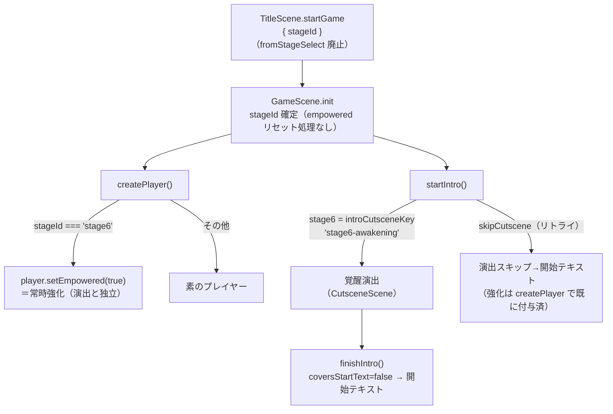
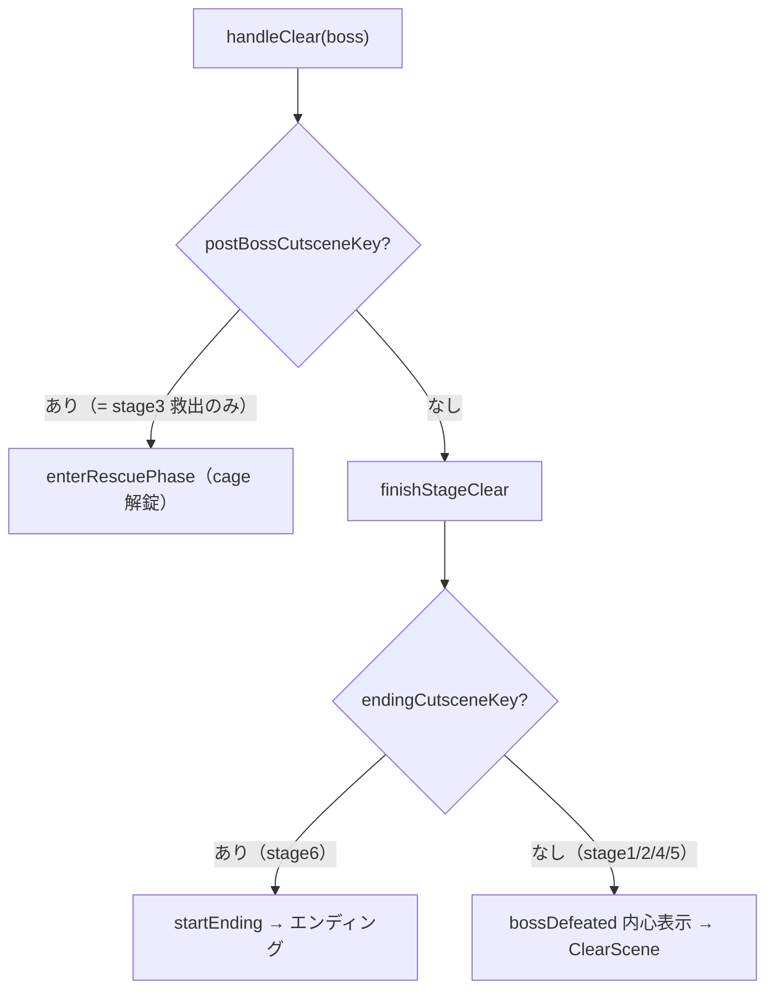

# 設計: RAY強化イベントを Stage6 開始へ移設

作成日: 2026-06-14
ブランチ: `feature/stage6-awakening`
設計担当: バルベルデ（architecture-designer）

---

## 1. 現状分析

### 強化フラグのライフサイクル（揮発・registry）

現状の強化は `PROGRESS.playerEmpowered`（registry・セーブ非保存）を「Stage5 で立て、Stage6
系列でだけ読む」という時間軸つきのフラグで実現している。これは
**「Stage5 撃破後に獲得 → Stage6 のプレイ系列（リトライ含む）でのみ有効 → 全クリア/単体選択で素」**
という3状態を両立させるための機構で、`fromStageSelect`（タイトル発のリセット信号）と
セットで成立している。

```
TitleScene.startGame  ──fromStageSelect:true──▶  GameScene.init  ──▶ registry=false
                                                          │
Stage5 finalizePostBossClear ───────────────────────────┼──▶ registry=true
                                                          │
GameScene.createPlayer  ◀──registry.get()=true──────────┘──▶ player.setEmpowered(true)
                                                          │
finalizeEnding（全クリア） ──────────────────────────────┴──▶ registry=false
```

この設計は「Stage6 に入った瞬間にはまだフラグが Stage5 から持ち越されている」ことに依存する。
**強化獲得を Stage6 開始へ移すと、この「持ち越し」自体が不要**になる。Stage6 でプレイヤーを
生成する時点で `stageId === 'stage6'` は自明だからだ。フラグという間接層を挟む理由が消える。

### 演出フローの分岐構造（現状）

```
handleClear(boss)
 ├ postBossCutsceneKey あり
 │   ├ cage あり  → enterRescuePhase     （stage3 救出）
 │   └ cage なし  → enterPostBossCutscene（stage5 強化）→ finalizePostBossClear
 └ postBossCutsceneKey なし → finishStageClear（stage1/2/4/6）
         ├ endingCutsceneKey あり → startEnding（stage6 エンディング）
         └ なし → ClearScene へ
```

intro 演出フロー（`startIntro` → CutsceneScene → `finishIntro`）は `introCutsceneKey` を持つ
ステージ（stage1/4/5）が利用する汎用機構として既に存在する。**Stage6 強化演出はこの
既存の intro 機構にそのまま乗せられる**（新フローの追加は不要）。

---

## 2. 設計オプションと採否

### 論点1: 強化付与の方式 ── 採用案: B（stageId 基準の常時強化）

| 案 | 内容 | 評価 |
|----|------|------|
| A | registry フラグを維持し、Stage6 intro 演出完了時に true 付与 | 演出完了に強化が依存。リトライ（演出スキップ）で強化が付かない不具合を生む。フラグ機構の複雑さも残る。**不採用** |
| **B** | **`createPlayer()` で `stageId === 'stage6'` なら無条件 `setEmpowered(true)`** | フラグ・`fromStageSelect` 一式を撤去できる。演出再生の有無と独立に強化が付く。最もシンプル。**採用** |

**採用理由**: 「Stage6 ＝常時強化」というステージ属性に単純化することで、3状態フラグ機構
（registry 4点 + `fromStageSelect`）が丸ごと不要になる。強化はステージの静的属性となり、
演出（intro カットシーン）は純粋に「物語を見せるだけ」の責務に純化する。関心の分離が改善する。

**実装の骨子**（実装は別作業。ここでは構造のみ）:

```ts
// createPlayer() 内
if (this.stageId === 'stage6') {
  this.player.setEmpowered(true);
}
```

`PROGRESS.playerEmpowered` の registry get/set（init / finalizePostBossClear /
createPlayer / finalizeEnding の4箇所）はすべて削除する。

#### `registryKeys.ts` の PROGRESS グループの扱い

`PROGRESS` は現状 `playerEmpowered` 1キーのみ。これを撤去すると **PROGRESS グループが空**になる。

- **決定**: `PROGRESS` の export 自体を削除する。空オブジェクトを残すと「将来また使うかもしれない」
  という曖昧なデッドコードになり、`import { HUD, PROGRESS }` の未使用 import で lint も鳴る。
  揮発進行フラグが再び必要になった時点で改めて追加すればよい（YAGNI）。
- `GameScene.ts` の import を `import { HUD } from '../config/registryKeys'` に縮める。

---

### 論点2: リトライ時の挙動 ── stageId 基準で自動的に解決

`skipCutscene`（ゲームオーバーからのやり直し）は intro カットシーンをスキップするが、
**案B では強化は `createPlayer()` が `stageId` だけを見て付与する**ため、カットシーン再生の
有無と完全に独立する。

- Stage6 を初回プレイ → intro 演出再生 → 強化付与 ✓
- Stage6 でゲームオーバー → リトライ（`skipCutscene=true`）→ 演出スキップ → **強化付与 ✓**

現状の registry 案ではフラグの「持ち越し」に頼っていたが、案B では `create()` が毎回
`stageId` から再導出するため、リトライでも確実に強化が乗る。**この独立性を design として明記する。**

---

### 論点3: 直接ステージ選択で Stage6 を選んだ場合 ── 常時強化（仕様変更を許容）

- **現状**: 単体選択で Stage6 → `fromStageSelect=true` → フラグ false → **素**（強化なし）。
- **変更後**: 単体選択で Stage6 → `createPlayer` が stageId で判定 → **常時強化**。

**妥当性**: ステージ選択は「そのステージを正規の状態で遊ぶ」ための機能。Stage6 の正規状態は
「RAY が支配中枢で覚醒し強化を得た状態」であり、強化ありがこのステージの本来の難易度バランス
（ECLIPSE 本体＝コア型ラスボスは強化前提の調整）。素で始める方がむしろ不整合だった。
よって**単体選択でも常時強化が正しい**。仕様変更として明記し、テストもこの仕様に追従させる。

---

### 論点4: デッドコードの扱い ── 撤去する

Stage5 から `postBossCutsceneKey` を外すと、`postBossCutsceneKey` を持つのは
**stage3（cage 救出）のみ**になる。その結果:

- `handleClear` の分岐 `cage あり → enterRescuePhase / cage なし → enterPostBossCutscene`
  のうち、**`cage なし` 枝が到達不能**になる。
- `enterPostBossCutscene()` と `finalizePostBossClear()` が**未使用**になる。

| 案 | 内容 | 評価 |
|----|------|------|
| 残す | 汎用「ボス後カットシーン」機構として温存 | 呼び出し元ゼロのデッドコード。`postBossCutsceneKey` を持つのは cage 必須の stage3 だけになり、汎用性も実体がない。lint/カバレッジのノイズ源。**不採用** |
| **撤去** | `enterPostBossCutscene` / `finalizePostBossClear` を削除し、`handleClear` の分岐を救出フロー専用に整理 | デッドコード除去。`handleClear` が「postBoss = 救出のみ」と読めて意図が明確になる。**採用** |

**採用理由**: 「将来の汎用機構」を呼び出し元なしで残すのは早すぎる抽象化。ボス後カットシーンが
再び必要になれば、その時の要件で設計し直す方が安全。現状は cage 救出だけが実体なので、
`handleClear` を救出専用に素直に書く。

**`handleClear` の整理方針**（構造のみ・実装は別作業）:

```ts
// postBossCutsceneKey を持つのは cage を伴う救出(stage3)のみになるため、
// cage 分岐は不要。postBossCutsceneKey ありをそのまま救出フローへ。
if (this.stage.postBossCutsceneKey) {
  this.inPostBoss = true;
  this.pendingClearTimeMs = clearTimeMs;
  this.boss = undefined;
  this.effects.bossDeathSequence(boss.x, boss.y, () => this.enterRescuePhase(boss));
  return;
}
```

> 補足: `cage` フィールドと `enterRescuePhase` は stage3 で現役のため**残す**。
> `postBossCutsceneKey` フィールド（型定義）も stage3 が使うため**残す**。撤去するのは
> `enterPostBossCutscene` / `finalizePostBossClear` の2メソッドと、cage 有無の二分岐のみ。

---

### 論点5: 撃破内心の復元 ── stage5.ts に `inner.bossDefeated` を復元（要・本文）

Stage5 から `postBossCutsceneKey` を外すと、Stage5 は**通常クリア経路 `finishStageClear`** に戻る。
`finishStageClear` は `inner.bossDefeated` を解決して表示してから遷移する設計なので、
現状 stage5.ts から削除されている `inner.bossDefeated` を**復元する必要がある**。

- 復元する文言: **「この気持ちは、私のものだ。それでいい」**
  （現状 `stage5-awakening` 冒頭の rayInner に移設されている撃破内心。これを stage5.ts へ戻す）
- stage5.ts の現状コメント（13-20 行の「移設済み」説明）も**書き換える**（移設前の状態へ戻す説明に）。

> 注: 本文（文言）の最終確定はモドリッチ担当。本設計では「`inner.bossDefeated` を持つ構造に戻す」
> という構造要件と、移設元の文言を明示する。`stage5-intro`（開始演出）はそのまま維持。

---

### 論点6: カットシーンのキー名 ── `stage5-awakening` → `stage6-awakening` にリネーム（推奨・採用）

舞台が Stage5 外縁部の「休眠コア共鳴」から Stage6 支配中枢の「突入時覚醒」へ移るため、
キー名も `stage6-awakening` へリネームするのが意味整合的。`stage5-awakening` のまま Stage6 で
使うと、キー名と実際の再生ステージが食い違い、将来の混乱を招く。

**リネームに伴う更新箇所**:

| ファイル | 箇所 | 変更 |
|----------|------|------|
| `src/config/story/cutscenes.ts` | `STAGE5_AWAKENING` 定数の `key: 'stage5-awakening'` | `key: 'stage6-awakening'`。定数名も `STAGE6_AWAKENING` へ。冒頭コメント（78-83行）を Stage6 舞台へ書き換え |
| `src/config/story/cutscenes.ts` | `CUTSCENES` マップ（125行） | `'stage5-awakening'` キーを `'stage6-awakening'` に |
| `src/config/stages.ts` | STAGE5 の `postBossCutsceneKey: 'stage5-awakening'`（426行） | **行ごと削除**（論点8参照） |
| `src/config/stages.ts` | STAGE6 | `introCutsceneKey: 'stage6-awakening'` を**追加**（論点7参照） |

> 演出スクリプト本文（lines）は Stage6 舞台（ECLIPSE 支配中枢への突入時の覚醒）へ書き直す。
> 本文はモドリッチ担当。冒頭にあった撃破内心「この気持ちは…」は stage5.ts へ戻す（論点5）ので、
> このスクリプトからは除く。

---

### 論点7: Stage6 の intro 二重表示 ── `introCutsceneCoversStartText` は立てない（採用）

Stage6 に `introCutsceneKey: 'stage6-awakening'` を足すと、intro 演出完了後の `finishIntro` が
`introCutsceneCoversStartText` を見て開始テキスト（`inner.stageStart` 等）の表示要否を決める。

- Stage6 の覚醒演出（`stage6-awakening`）の内容と、開始テキスト
  （intro「一番奥の部屋…」+ 内心「ここだ。ここで、終わる。」）は**別内容**。
- 覚醒（強化獲得）と「中枢に到達した決意」はどちらも見せたい情報。

→ **`introCutsceneCoversStartText` は false のまま（フィールド未設定）**にする。
これにより stage4/5 と同じ「演出 → 開始テキスト」の流れに合流する。Stage1 のように演出が
開始テキストを兼ねるケース（true）とは異なる。

> 既存テスト `storyData.test.ts:153` 「stage4 / stage5 は演出と開始テキストが別内容」に
> **stage6 を追加**して同じ性質を保証する（論点9）。

---

### 論点8: 変更ファイル一覧（src / tests / docs）

#### src/（構造・フロー）

| ファイル | 変更内容 |
|----------|----------|
| `src/scenes/GameScene.ts` | ① `init()` の `fromStageSelect` 分岐削除（114-116行）。② `createPlayer()` の registry 判定を `stageId === 'stage6'` 判定へ置換（455-457行）。③ `enterPostBossCutscene` / `finalizePostBossClear` メソッド削除（347-382行）。④ `handleClear` の cage 二分岐を救出フロー単一へ整理（710-720行）。⑤ `finalizeEnding` の `registry.set(PROGRESS.playerEmpowered,false)` 削除（786行）。⑥ `GameSceneData.fromStageSelect` フィールド削除（54行）+ JSDoc（50-53行）整理。⑦ `import { HUD, PROGRESS }` → `import { HUD }`（4行） |
| `src/scenes/TitleScene.ts` | `startGame` の `transitionTo(... { stageId, fromStageSelect: true })` から `fromStageSelect` を除去（125行）。コメント（123-124行）整理 |
| `src/config/registryKeys.ts` | `PROGRESS` グループ全体を削除（22-30行） |
| `src/config/stages.ts` | STAGE5: `postBossCutsceneKey: 'stage5-awakening'` 行を削除（426行）+ 該当コメント整理。STAGE6: `introCutsceneKey: 'stage6-awakening'` を追加（+ コメント） |
| `src/config/story/cutscenes.ts` | `STAGE5_AWAKENING`→`STAGE6_AWAKENING` リネーム（key/定数名/コメント/本文）。`CUTSCENES` マップのキー更新。**本文は Stage6 舞台へ書き直し（モドリッチ）** |
| `src/config/story/stage5.ts` | `inner.bossDefeated` を復元（文言「この気持ちは、私のものだ。それでいい」）。移設コメント（13-20行）を書き換え |

> `src/config/story/stage6.ts` は `inner.stageStart`/`bossDefeated` 等を既に持つ。intro 演出の
> 追加により `inner.stageStart` は `finishIntro` 経由で表示される（現状の開始テキスト直出しから
> 演出後表示へ変わるが、内容・キーは不変）。**stage6.ts 自体の構造変更は不要**。

#### tests/

| ファイル | 変更内容 |
|----------|----------|
| `tests/unit/config/cutscenes.test.ts` | `stage5-awakening` 参照（138-161行付近）を `stage6-awakening` へ更新。冒頭 rayInner が「この気持ちは…」だった検証（143-147行）は**削除/付け替え**（撃破内心は stage5.ts へ戻るため、このスクリプト冒頭ではなくなる）。Stage6 舞台に即した新本文の検証へ差し替え（本文はモドリッチ確定後） |
| `tests/unit/config/storyData.test.ts` | ① stage5 の撃破内心検証（66-72行）を「stage5.ts `inner.bossDefeated` が定義され、finishStageClear で表示される」前提へ戻す。② 「stage5 は cage を持たない強化演出を持つ」（105-110行）を**削除**（stage5 は postBossCutsceneKey を持たなくなる）。③ 「postBossCutsceneKey を持つのは stage3 のみ」を保証する検証へ更新（98行の配列に stage5 を追加）。④ 「stage4/5 は演出と開始テキストが別内容」（153-159行）に **stage6 を追加**。⑤ stage6 の `introCutsceneKey === 'stage6-awakening'` を検証する it を追加 |

> `playerEmpowered` / `fromStageSelect` を直接参照するテストは**現状存在しない**
> （grep 結果: tests 配下にヒットなし）。よって registry フラグ撤去によるテスト破壊はない。
> 強化付与のロジック（`createPlayer` の stageId 判定）は GameScene の Phaser 依存が重く単体化が
> 難しいため、**config レベル（stage6 が intro 演出キーを持つ／postBossKey を持たない）で
> 仕様を担保する**方針とする（論点9）。

#### docs/

| ファイル | 変更内容 |
|----------|----------|
| `docs/story.md` | Stage5「ボス撃破後：自分を受け入れる」（355行）と Stage6 開始（360行）のビート整合を見直す。現状 story.md は強化獲得（最後の光）を Stage5 撃破後に置いていないが、実装の `stage5-awakening` は「休眠コア共鳴で光を受け取る」演出だった。**強化獲得の場面を Stage6 開始（中枢突入時の覚醒）へ移す旨**を story.md のビートに反映する（物語整合の正本同期）。**本文確定はモドリッチ**。本設計はこの同期が必要な箇所を指摘するに留める |

---

### 論点9: テスト影響と追加すべき観点

#### 既存テストの洗い出し（grep 確定）

- `stage5-awakening` 参照: `cutscenes.test.ts`（138-161）, `storyData.test.ts`（66-72, 105-110）
- `playerEmpowered` 参照: テストには**なし**（src のみ）
- `fromStageSelect` 参照: テストには**なし**（src のみ）

#### 追加すべきテスト観点

1. **Stage6 が覚醒演出を intro として持つ**: `getStageData('stage6').introCutsceneKey === 'stage6-awakening'`。
2. **Stage6 は演出と開始テキストが別内容**: `introCutsceneCoversStartText` が falsy（stage4/5 と同列）。
3. **Stage5 は postBossCutsceneKey を持たない**: 通常クリア経路へ戻ったことの保証。
   `postBossCutsceneKey` を持つのは stage3 のみ、を全ステージで検証。
4. **Stage5 撃破内心の復元**: `getStageStory('stage5').inner.bossDefeated === 'この気持ちは、私のものだ。それでいい'`
   （文言はモドリッチ確定に追従）。
5. **`stage6-awakening` カットシーンの登録と構成**: `getCutscene('stage6-awakening')` が定義され、
   `rayInner`/`direction`（必要なら `terraLine`）で構成され、禁止語（科学者・メモリ・設計者・記録）を含まない
   ＝既存 `stage5-awakening` テストの観点を Stage6 舞台向けに引き継ぐ。
6. **`stage5-awakening` キーが消えていること**: `getCutscene('stage5-awakening')` が undefined
   （リネーム漏れ・参照残りの検出）。

> 注意（CLAUDE.md テスト原則）: 文言を verbatim でアサートするテストは本文確定後にモドリッチが
> 値を埋める。構造（キーの有無・フローの分岐条件）のテストは本文に依存せず先行で書ける。

---

## 3. アーキテクチャ図

### 変更後の強化付与フロー（フラグ機構の撤廃）



### 変更後の handleClear 分岐（救出専用へ整理）



> 旧 `cage なし → enterPostBossCutscene → finalizePostBossClear`（stage5 強化）経路は消滅。
> stage5 は右下「ClearScene」経路へ合流し、撃破内心を表示してから次ステージへ進む。

---

## 4. リスクと緩和策

| リスク | 緩和策 |
|--------|--------|
| `stage5-awakening` キーの参照残り（リネーム漏れ）でランタイム未登録 | 論点9-6 のテスト（旧キーが undefined）で検出。grep で `stage5-awakening` 全消去を確認 |
| Stage5 が通常クリア経路に戻った際、撃破内心が出ず無言で遷移 | stage5.ts に `inner.bossDefeated` を確実に復元（論点5）。storyData テストで担保（論点9-4） |
| Stage6 単体選択時に強化が付くことのバランス懸念 | Stage6 ボス（コア型）は強化前提の調整。素より整合的（論点3）。実機で撃破可能性を確認（CLAUDE.md「実プレイ挙動まで検証」） |
| リトライで演出スキップ時に強化が落ちる回帰 | 案B は `createPlayer` が stageId 基準のため演出と独立（論点2）。実機でゲームオーバー→リトライ後に強化が乗ることを確認 |
| `PROGRESS` 削除で未使用 import が残り lint 失敗 | GameScene の import を `{ HUD }` へ縮小。push 前に lint/typecheck/test/build を全通し（CLAUDE.md） |
| docs/story.md と実装の乖離（強化の場面が Stage5→Stage6 へ移動） | story.md のビートを同期（論点8 docs）。docs は実装を正本とする運用（メモリ既知）だが、北極星整合のため明示更新 |
| Stage6 intro 演出追加で `inner.stageStart` の表示タイミングが変わる（直出し→演出後） | `finishIntro` が `coversStartText=false` で開始テキストを出す既存挙動に合流。stage4/5 で実績ありの経路。実機で開始テキストが出ることを確認 |

---

## 5. 次のステップ（実装優先順位）

1. **config 層（低リスク・テスト先行可）**
   - `stages.ts`: STAGE5 から `postBossCutsceneKey` 削除 / STAGE6 へ `introCutsceneKey` 追加
   - `cutscenes.ts`: `stage6-awakening` へリネーム（本文書き直しはモドリッチ）
   - `stage5.ts`: `inner.bossDefeated` 復元
   - `registryKeys.ts`: `PROGRESS` 削除
2. **scene 層**
   - `GameScene.ts`: createPlayer の stageId 判定化 / フラグ4点撤去 / デッドメソッド2つ削除 /
     handleClear 整理 / GameSceneData 整理 / import 縮小
   - `TitleScene.ts`: `fromStageSelect` 除去
3. **tests**: storyData / cutscenes テストを新仕様へ追従 + 追加観点（論点9）
4. **docs/story.md** ビート同期（強化獲得の場面移動）
5. **検証**: lint / typecheck / test / build 全通し → 実機で
   (a) Stage6 初回（演出→強化）, (b) Stage6 リトライ（演出スキップでも強化）,
   (c) Stage6 単体選択（強化）, (d) Stage5 撃破内心表示 → ClearScene を確認

---

## 付録: 撤去するコード一覧（確定）

| 対象 | 場所 | 種別 |
|------|------|------|
| `enterPostBossCutscene()` メソッド | `GameScene.ts` 347-364 | メソッド削除 |
| `finalizePostBossClear()` メソッド | `GameScene.ts` 370-382 | メソッド削除 |
| `init()` の `fromStageSelect` 分岐 | `GameScene.ts` 114-116 | ブロック削除 |
| `createPlayer()` の `registry.get(PROGRESS.playerEmpowered)` 判定 | `GameScene.ts` 455-457 | stageId 判定へ置換 |
| `finalizeEnding()` の `registry.set(PROGRESS.playerEmpowered,false)` | `GameScene.ts` 786 | 行削除 |
| `GameSceneData.fromStageSelect` フィールド | `GameScene.ts` 50-54 | フィールド+JSDoc 削除 |
| `import { ..., PROGRESS }` | `GameScene.ts` 4 | import 縮小 |
| `PROGRESS` グループ | `registryKeys.ts` 22-30 | export 削除 |
| `fromStageSelect: true` 引数 | `TitleScene.ts` 125 | 引数除去 |
| `postBossCutsceneKey: 'stage5-awakening'` | `stages.ts` 426 | 行削除 |
| `handleClear` の cage 二分岐 | `GameScene.ts` 715-718 | 救出単一フローへ整理 |

> **残すもの**（撤去しない）: `cage` フィールド / `enterRescuePhase`（stage3 現役）、
> `postBossCutsceneKey` 型フィールド（stage3 現役）、`finishStageClear` / `startEnding` /
> `finalizeEnding` 本体（finalizeEnding は registry 行のみ削る）、intro 演出機構一式
> （`startIntro`/`finishIntro`/`introCutsceneCoversStartText`）。
