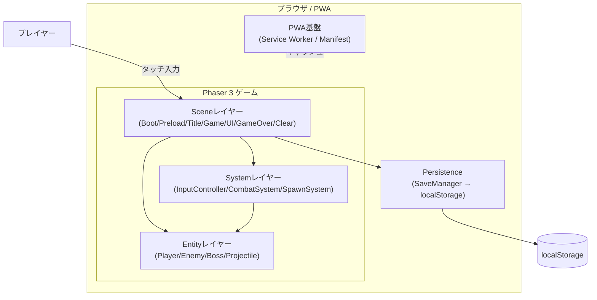
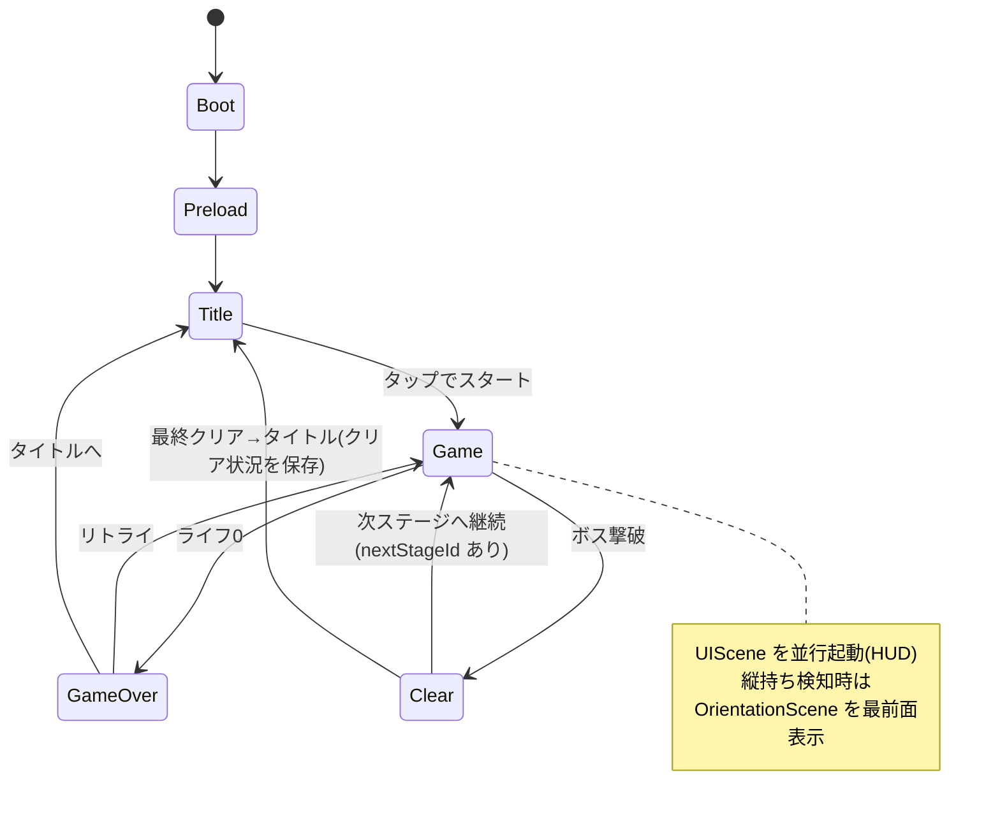
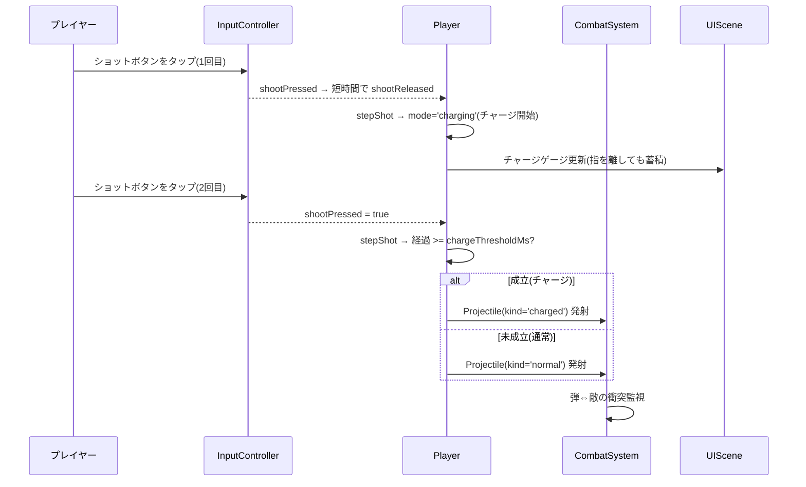
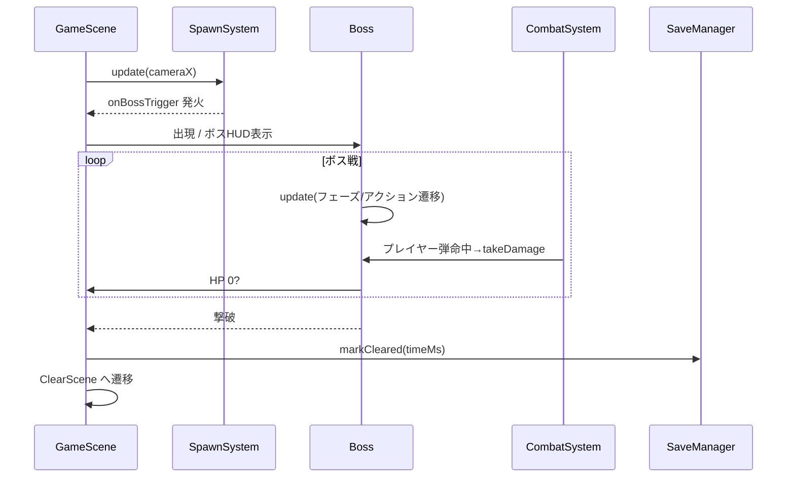

# 機能設計書 (Functional Design Document)

> 本書は `docs/product-requirements.md`(PRD)で定義した MVP 要件(P0)を、Phaser 3 ベースの PWA としてどう実現するかを定義する。MVP のスコープは「タイトル画面 + 1 ステージ + ボス 1 体」「両手・横向き専用のタッチ操作」「完全オフライン(localStorage)」。

## システム構成図



- **Sceneレイヤー**: Phaser の Scene 単位で画面/状態を管理。シーン遷移で画面遷移を表現する。
- **Entityレイヤー**: プレイヤー・敵・ボス・弾など、ゲーム内オブジェクト。物理ボディと状態を持つ。
- **Systemレイヤー**: 入力解釈・戦闘判定・敵出現など、Entity をまたぐ横断ロジック。
- **Persistence**: クリア状況/設定の保存。`localStorage` のみ(サーバ通信なし)。
- **PWA基盤**: Service Worker によるオフライン動作、Manifest によるホーム画面追加。

## 技術スタック

| 分類 | 技術 | 選定理由 |
|------|------|----------|
| 言語 | TypeScript 5.x | 型安全。Phaser が型定義を提供。CLAUDE.md の技術スタック準拠 |
| ランタイム/PM | Node.js v24 / npm | devcontainer 環境の指定 |
| ゲームエンジン | Phaser 3 | 2D の定番。スプライト/アニメ/Arcade Physics/タイルマップ/サウンド/入力を内包 |
| 物理 | Phaser Arcade Physics | AABB ベースで軽量。横スクロールジャンプアクションに十分かつモバイルで高速 |
| ビルド/開発サーバ | Vite | 高速 HMR、TS 標準対応。本番ビルドの最適化 |
| PWA | vite-plugin-pwa (Workbox) | Service Worker / Manifest 生成を自動化。オフライン対応 |
| 永続化 | Web Storage API (localStorage) | サーバ不要・端末内完結。MVP の完全オフライン方針に合致 |
| アセット | CC0 等フリー素材 + 生成AI/自作 | 権利クリアなオリジナル構成 |

## ゲーム状態(シーン)構成

Phaser の Scene を画面/状態の単位とする。

| シーン | 責務 |
|--------|------|
| `BootScene` | 最小設定の初期化、Preload への遷移。表示スケール/向き設定 |
| `PreloadScene` | アセット(スプライト/タイルマップ/音)の一括ロード、ローディング表示 |
| `TitleScene` | タイトル画面(`LAST SPARK` ロゴ + 「タップでスタート」)。クリア済みフラグの表示 |
| `GameScene` | ステージ本体。プレイヤー/敵/ボス/弾/カメラ/物理を統括 |
| `UIScene` | HUD(プレイヤーライフ、ボスHP、チャージゲージ)。`GameScene` と並行起動 |
| `GameOverScene` | ゲームオーバー表示とリトライ導線 |
| `ClearScene` | ボス撃破時のクリア演出。クリア状況を保存しタイトルへ |
| `OrientationScene`(オーバーレイ) | 縦持ち検知時に「横向きにしてください」案内を最前面表示 |

## データモデル定義

> ゲームの状態は実行時の Entity が保持する。永続化対象は最小限(クリア状況・設定)に絞る。

### 永続データ: SaveData(localStorage)

```typescript
interface SaveData {
  version: number;          // セーブ構造のバージョン(マイグレーション用)
  cleared: boolean;         // ステージ1(ボス)をクリア済みか
  bestTimeMs?: number;      // ステージクリア最速タイム(ミリ秒)、未クリアは undefined
  settings: GameSettings;   // ユーザー設定
}

interface GameSettings {
  muted: boolean;           // サウンドミュート(モバイル自動再生制約に配慮、既定 false)
  bgmVolume: number;        // 0.0–1.0
  seVolume: number;         // 0.0–1.0
}
```

**制約**:
- 保存キーは `lastspark:save`(名前空間付き)。
- `localStorage` 利用不可・破損時は既定値で起動し、ゲーム自体は継続可能(進捗が無いだけ)。
- `version` 不一致時は安全側にフォールバック(既定値で再生成)。

### 実行時モデル: 主要 Entity

```typescript
// プレイヤー(最後のロボット)
interface PlayerState {
  hp: number;               // 現在ライフ(整数)
  maxHp: number;            // 最大ライフ
  facing: 'left' | 'right'; // 向き(ショット方向に使用)
  onGround: boolean;        // 接地判定
  shotState: ShotState;     // ショット操作の状態(shotControl: idle/pending/charging/holding/postFire)
  invincibleUntil: number;  // 無敵終了時刻(ms)。被弾後の点滅無敵
}

// 弾(通常/チャージ共通)
interface ProjectileState {
  kind: 'normal' | 'charged';
  damage: number;           // kind により決定
  velocityX: number;        // 進行方向 × 速度
  owner: 'player' | 'enemy';
}

// 雑魚敵
interface EnemyState {
  hp: number;
  contactDamage: number;    // 接触ダメージ
  pattern: EnemyPattern;    // 移動/攻撃パターン識別子
}

// ボス(大型警備機)
interface BossState {
  hp: number;
  maxHp: number;
  phase: BossPhase;         // HP に応じた行動フェーズ
  currentAction: BossAction;
  actionEndsAt: number;     // 現在アクションの終了時刻(ms)
}

type EnemyPattern = 'walker' | 'turret';      // MVP の雑魚2種(案)
type BossPhase = 'phase1' | 'phase2';          // HP 50% で移行
type BossAction = 'idle' | 'move' | 'shoot' | 'jump' | 'stagger';
```

### パラメータ定義(チューニング値の集中管理)

> マジックナンバーをコードに散らさず、定数モジュールに集約する(難易度調整・テストを容易にする)。

```typescript
// 例: src/config/balance.ts
export const PLAYER = {
  maxHp: 16,
  moveSpeed: 160,        // px/s
  jumpVelocity: -420,    // px/s(上向き負)
  invincibleMs: 800,     // 被弾後の無敵時間
} as const;

export const SHOT = {
  normalDamage: 1,
  chargedDamage: 3,
  chargeThresholdMs: 600, // この長さ以上の長押しでチャージ成立
  normalSpeed: 420,
  chargedSpeed: 480,
  cooldownMs: 180,        // 連射間隔
} as const;

export const BOSS = {
  maxHp: 40,
  phase2HpRatio: 0.5,
} as const;
```

## コンポーネント設計

### InputController(Systemレイヤー)

**責務**:
- 横向き・両手前提のタッチ入力を、抽象的な操作意図(move/climb/jump/shoot)に変換する。
- 画面左半分=追従パッド(横変位=左右移動、縦変位=梯子昇降の `climbDir`)、右側=ジャンプ/ショットの仮想ボタンを管理する。縦は誤反応抑制のため横より大きい不感帯(`CLIMB_DEADZONE_PX`)を用い、`climbDir` は梯子に重なっている時のみ Player 側で使用する。
- 左親指=移動/昇降、右親指=ジャンプ/ショットに役割を分離する。3 ポインタのマルチタッチで移動とジャンプ・ショットを同時に扱う。キーボード(開発時、矢印 上下=昇降)もフォールバックで受ける。

**インターフェース**:
```typescript
interface InputState {
  moveDir: -1 | 0 | 1;   // -1=左, 0=停止, 1=右
  climbDir: -1 | 0 | 1;  // 梯子昇降の上下入力。-1=上(登る), 0=なし, 1=下(降りる)
  jumpPressed: boolean;  // このフレームでジャンプ入力が立ち上がったか
  jumpHeld: boolean;     // ジャンプボタン押下中(可変ジャンプ高さ制御)
  shootPressed: boolean; // このフレームでショット入力が立ち上がったか(タップ/連射の起点)
  shootHeld: boolean;    // ショットボタン押下中(連射・押下継続判定)
  shootReleased: boolean;// このフレームで離されたか(タップ確定トリガ)
}

class InputController {
  update(): InputState;          // 毎フレーム最新の入力状態を返す
  attachTouchZones(): void;      // 左右ゾーン/仮想ボタンの登録
}
```

**依存関係**: Phaser の入力(Pointer/Keyboard)、`UIScene`(追従パッド/ショットボタン描画)。

### CombatSystem(Systemレイヤー)

**責務**:
- 弾⇔敵、弾⇔ボス、プレイヤー⇔敵/ボス/敵弾 の衝突処理とダメージ適用。
- 被弾時の無敵・点滅、撃破時のヒット表現発火。

**インターフェース**:
```typescript
class CombatSystem {
  registerColliders(scene: GameScene): void;
  applyDamage(target: Damageable, amount: number): void;
}
```

**依存関係**: Arcade Physics、Entity 群、`UIScene`(HP 反映)。

### SpawnSystem(Systemレイヤー)

**責務**: ステージ進行(カメラ位置/トリガ)に応じた雑魚敵の出現、ボス戦エリアへの到達検知。

```typescript
class SpawnSystem {
  loadStage(stageId: string): void;   // 敵配置データの読み込み
  update(cameraX: number): void;       // 進行に応じた出現制御
  onBossTrigger(cb: () => void): void; // ボス戦突入トリガ
}
```

### ステージ構成と地形ギミック(複数ステージ / すり抜け床 / 梯子)

**ステージデータ**: 各ステージは `StageData`(地形 `platforms`、梯子 `ladders?`、敵 `enemies`、ボストリガー、`nextStageId?`)としてコード定義し、`getStageData(stageId)` で引く。`GameScene.init({ stageId })` で開始ステージを受け、`nextStageId` を辿って stage1 → stage2 と続ける(`nextStageId` 無し=最終ステージ)。

**すり抜け床(ワンウェイ床)**: 地形は高さで `height>40`=地面(全面衝突)、それ以下=浮遊足場(ワンウェイ)に分け、別グループにする。プレイヤー/敵×足場の collider は `processCallback` を持ち、純粋関数 `shouldLandOnOneWay(bottom, velY, platformTop)`(下降中かつ足元が床上端付近)が真の時だけ衝突を有効化する。これにより足場は「上から着地・下から通過」になる(地面は従来どおり全面衝突)。ボスは地面のみと衝突する。

**梯子(ladder)**: `StageData.ladders` の矩形を `GameScene.buildLadders` が見た目(タイル)として敷き、矩形配列を `Player.setLadders` へ渡す(物理衝突はさせない)。Player は純粋関数 `overlapsAnyLadder` / `resolveLadderState` / `climbVelocity` で把持状態を判定し、把持中は重力を切って(`setAllowGravity(false)`)上下入力で鉛直移動する。離脱時に重力を必ず戻す。梯子昇降中はプレイヤーの足場 collider を抑制し、ワンウェイ床を貫通して登り降りできる(梯子上端=直上の足場上端に揃え、登り切ると足場に乗れる動線)。これらの純粋ロジックは `systems/playerMovement.ts` に集約しユニットテスト可能にする。

### SoundManager(Systemレイヤー)

**責務**:
- 外部音源ファイルを使わず、`src/config/audio.ts` の合成仕様を Web Audio で手続き生成して再生する(知財・コンプライアンス方針に準拠)。
- SE(効果音)13 種の単発再生と、BGM 3 トラック(`title` / `stage` / `boss`)のループ再生・切替を担う。
- `GameSettings`(`muted` / `bgmVolume` / `seVolume`)に従って音量・ミュートを反映。iOS Safari 等の自動再生制約に備え、初回ポインタ操作までは無音とし、操作を起点にオーディオを解放する。

```typescript
class SoundManager {
  unlock(): void;                 // 初回ユーザー操作でオーディオ解放
  playSe(key: SeKey): void;       // 単発SE(jump/shootNormal/bossHit など13種)
  playBgm(key: BgmKey): void;     // BGMループ再生・切替(title/stage/boss)
  stopBgm(): void;
  applySettings(s: GameSettings): void; // ミュート/音量の反映
}
```

**依存関係**: Web Audio API、`config/audio.ts`(SE/BGM の合成仕様)、`GameSettings`。純粋な合成ロジックは `systems/soundSynth.ts` に分離する。

### Player / Enemy / Boss / Projectile(Entityレイヤー)

各 Entity は Phaser の `Arcade.Sprite` を継承し、自身の状態(上記モデル)と振る舞い(`update`)を持つ。なお、キャラの物理(`Arcade.Sprite`)と見た目は分離しており、頭・胴・腕・脚を関節化した `CharacterRig`(`entities/CharacterRig.ts`)へ表示を委譲する(詳細は `docs/architecture.md` の「見た目リグの分離」を参照)。

```typescript
class Player extends Phaser.Physics.Arcade.Sprite {
  applyInput(input: InputState): void; // 入力に基づく移動/ジャンプ/発射
  takeDamage(amount: number): void;
  // ショット操作(タップ=チャージ、再タップ=発射、長押し=連射)は
  // 純粋状態機械 systems/shotControl.ts(stepShot)で解釈する。
}

class Boss extends Phaser.Physics.Arcade.Sprite {
  update(time: number, playerX: number): void; // フェーズ/アクション遷移
  takeDamage(amount: number): void;
}
```

### SaveManager(Persistence)

**責務**: `SaveData` の読み書き、既定値生成、バージョン検証。

```typescript
class SaveManager {
  load(): SaveData;             // 失敗時は既定値を返す(throw しない)
  save(data: SaveData): void;   // localStorage 不可時は黙って no-op + 警告ログ
  markCleared(timeMs: number): void;
  updateSettings(s: Partial<GameSettings>): void;
}
```

## 画面遷移図



## ユースケース(主要フロー)

### UC-1: チャージショットを撃つ



**フロー説明**:
1. ショットボタンの 1 回目タップ(短押し→離す)で `shotControl` が `charging` に遷移し、チャージ開始時刻を記録。指を離してもゲージは蓄積し続ける。
2. `UIScene` がチャージゲージを伸ばし、しきい値到達で発光(視覚フィードバック)。
3. 2 回目タップ(`shootPressed`)で経過時間を判定し、`chargeThresholdMs` 以上ならチャージ弾、未満なら通常弾を発射。
4. ショットボタンを `holdToAutoFireMs` 以上押し続けた場合は、チャージせず通常弾を `cooldownMs` 間隔で連射する。`burstSize` 発撃つごとに `burstPauseMs` の小休止を挟み、連射にリズムを与える。
5. いずれも `cooldownMs` の連射間隔を超えていない場合は発射しない。

### UC-2: ボス戦突入〜撃破



## ボス行動設計(アルゴリズム)

**目的**: ボス1体で「単調でない」行動を成立させる(PRD 受け入れ条件)。HP に応じた2フェーズ + 重み付きアクション選択。

### フェーズ遷移
- `phase1`: HP > 50%。アクション間隔は標準。
- `phase2`: HP <= 50%(`BOSS.phase2HpRatio`)。アクション間隔短縮 + `jump` の頻度増で攻勢を強める。

### アクション選択ロジック
現在アクションが終了(`actionEndsAt` 到達)したら、次アクションをフェーズ別の重みで抽選する。直前と同じ攻撃の連続を避ける。

```typescript
function pickNextAction(phase: BossPhase, last: BossAction): BossAction {
  // フェーズ別の重みテーブル(合計は任意、相対値)
  const weights: Record<BossPhase, Partial<Record<BossAction, number>>> = {
    phase1: { move: 35, shoot: 35, idle: 15, jump: 15 },
    phase2: { move: 30, shoot: 35, idle: 5, jump: 30 },
  };
  const table = weights[phase];
  // 直前と同一アクションは重みを半減(連続を抑制)
  const adjusted = Object.entries(table).map(([action, w]) =>
    [action, action === last ? w * 0.5 : w] as [BossAction, number]
  );
  return weightedRandom(adjusted); // 重み付き抽選
}
```

- `move`: 前後に移動してペースする(プレイヤーへ一方的に詰めず、間合いを取り直す)。アリーナ端では内側へ向く。
- `shoot`: プレイヤー方向へ弾を発射(phase2 では弾数/頻度を上げる)。
- `jump`: その場/前後ドリフトしながらジャンプする(縦の動きで単調さを崩す)。重力で着地する。
- `stagger`: 一定ダメージ蓄積で短時間のけぞり(反撃チャンス)。
- `idle`: 短い静止(プレイヤーに行動を読ませる間)。

> ※ 突進(`charge`)は MVP の調整で廃止し、`jump` と前後移動(`move`)に置き換えた。

## UI設計(HUD / タッチUI)

### HUD(UIScene)

| 項目 | 説明 | 表示 |
|------|------|------|
| プレイヤーライフ | 現在/最大HP | 左上のエナジーバー(セグメント式) |
| ボスHP | ボス戦中のみ | 画面下部または上部のボスゲージ |
| チャージゲージ | チャージ蓄積量 | ショットボタン付近に円/バーで表示、しきい値で発光 |

### タッチUI(横向き・両手専用)

```
（横向き / 両手持ち）
┌───────────────────────────────────────────────────────┐
│  プレイ領域(ボス・弾幕はこの上側にのみ描画される)        │
│   ◀ 歩行 ▶ (追従パッド/左手)                            │
├───────────────────────────────────────────────────────┤
│  下部コントロール帯(タッチ時のみ)   ◯ショット ◯ジャンプ │ ← 右手親指
└───────────────────────────────────────────────────────┘
```

- 左の追従パッドは触れた箇所を原点とし、横変位で左右移動する(移動専用)。
- **下部コントロール帯(レターボックス)**: 純タッチ端末では画面下部に仮想ボタン専用の帯を設け、ゲーム描画(カメラ viewport)を帯の上へ収める。これにより「指が乗る帯」と「ボス・弾幕が見えるプレイ領域」を物理的に分離し、ボス戦で右下ボタンに乗せた指がボスを隠す問題を防ぐ。帯高さ・端末判定は `src/config/controlBand.ts` に集約し、カメラ(`GameScene`)・描画(`UIScene`/`TouchControls`)・入力判定(`InputController`)が同じ値を共有する。判定は `(pointer: coarse)` かつ `(any-pointer: fine)` 無し(=マウス等の精密ポインタを持たない純タッチ端末)を条件とし、**タッチ対応PCやマウス併用端末・デスクトップでは帯を出さずフル画面で従来挙動を維持**する。
  - **ズーム倍率は帯の有無に関わらず「画面全体の高さ」基準を維持**する(`zoom = scale.height / GAME_HEIGHT`)。帯はあくまで viewport を下から削るだけとし、世界の見かけの大きさを変えない。これにより「帯ぶん世界が縮小して見える」問題と「`displayWidth` 変化でボストリガーがズレる」問題を同時に防ぐ(帯ぶん縦の可視範囲が減るが、隠れるのは地面より下=落下域中心)。
  - 帯の縦割合は控えめ(`CONTROL_BAND_RATIO`)にし、ボタンが収まる最小高さ(`CONTROL_BAND_MIN_PX`)まで狭めてプレイ領域を広く保つ。
- ジャンプ/ショットの 2 ボタンは帯の縦中央に水平に並べ、画面右側に集約する(`src/config/touchLayout.ts`)。両ボタンとも左手の移動操作と干渉せず、サイズ/透明度は実機調整。
- ショット操作: 1 回目タップでチャージ開始(離してもゲージ蓄積)、2 回目タップで発射。長押しはチャージせず通常弾を連射(`SHOT.burstSize` 発ごとに `SHOT.burstPauseMs` の小休止)。
- 移動(左親指)とジャンプ/ショット(右親指)を別ポインタで同時操作できる。
- 縦持ち検知時は `OrientationScene` を重ね、横向きへの回転を促す。

### カラーコーディング(世界観: 暗め基調 + 発光アクセント)
- 背景/廃墟: 低彩度の暗色。
- プレイヤーのコア/弾/敵コア: ネオン発光色(グロー/明度差で表現)。
- チャージ完了: 発光色を強めて成立を明示。

## アセット / ファイル構造(ランタイム読み込み)

```
public/assets/
├── sprites/      # プレイヤー/敵/ボス/弾のスプライトシート
├── tilemaps/     # ステージ1(崩れた都市)のタイルマップ + タイルセット
└── ui/           # 仮想ボタン/ロゴ/HUD 画像
```

- スプライトはスプライトシート + アニメ定義で管理。
- ステージは Tiled 形式のタイルマップ(JSON) + 敵配置レイヤーで定義し、`SpawnSystem` が読む。
- **サウンドは外部音源ファイルを持たない**。SE/BGM は `src/config/audio.ts` の合成仕様から `SoundManager` が Web Audio で手続き生成するため、`audio/` アセットは不要(知財方針にも合致)。

## パフォーマンス最適化

- **オブジェクトプール**: 弾・ヒットエフェクトは生成/破棄を繰り返すためプールで再利用し GC を抑制。
- **テクスチャアトラス**: スプライトをアトラス化しドローコールを削減。
- **Arcade Physics 限定**: 重い物理(Matter)は使わず AABB のみでモバイル 60fps を狙う。
- **オフスクリーン非更新**: 画面外の敵は更新/描画を抑制(必要範囲のみアクティブ化)。
- **Service Worker キャッシュ**: 2回目以降の起動を高速化。

## セキュリティ考慮事項

- **外部通信なし**: MVP はサーバ通信を行わず、外部送信による情報漏洩リスクを持たない。
- **機密情報の非保持**: API エンドポイント/キー等をソース・ドキュメントに含めない(該当機能なし)。
- **localStorage の扱い**: 保存値は信頼境界内の自端末データのみ。読み込み時は型/バージョン検証し、不正値は既定にフォールバック(改ざんされても進行不能にならない)。
- **知的財産**: キャラ・スプライト・名称・音楽はオリジナル or CC0 等の商用利用可ライセンスに限定。

## エラーハンドリング

| エラー種別 | 処理 | プレイヤーへの表示 |
|-----------|------|-----------------|
| アセット読み込み失敗 | リトライ後、不可なら代替表示でフォールバック | "読み込みに失敗しました。再読み込みしてください" |
| localStorage 利用不可/破損 | 既定値で起動、保存は no-op(警告ログのみ) | 表示なし(進捗が保存されないだけ、プレイは継続) |
| 縦持ち(非対応の向き) | `OrientationScene` を表示、ゲームを一時停止 | "端末を横向きにしてください" |
| サウンド自動再生ブロック | 初回タップ後にオーディオ解放、それまで無音 | 表示なし(タップで自然に解放) |
| 想定外の実行時例外 | 当該シーンを安全に停止しタイトルへ復帰 | "エラーが発生しました。タイトルに戻ります" |

## テスト戦略

### ユニットテスト
- `pickNextAction`(ボス行動抽選): 直前アクションの連続抑制、フェーズ別に許可アクションが選ばれること。
- チャージ判定(`chargeThresholdMs` 境界): しきい値直前=通常弾、しきい値以上=チャージ弾。
- `SaveManager`: 既定値生成、バージョン不一致のフォールバック、localStorage 例外時に throw しないこと。
- ダメージ適用/無敵時間: 無敵中は重複ダメージを受けないこと。

### 統合テスト
- 入力 → プレイヤー移動/ジャンプ/発射の一連が `InputState` 経由で正しく反映される。
- 弾⇔敵/ボスの衝突でHPが減少し、0で撃破/ゲームオーバーに遷移する。

### E2Eテスト(Playwright)
- タイトル → スタート → 導入区間突破 → ボス撃破 → クリア → タイトルへ、の一連が完了する。
- 縦持ち(画面回転)で案内が表示され、横向きでプレイ再開できる。
- リロード後もクリア状況が保持される(localStorage 永続化)。
