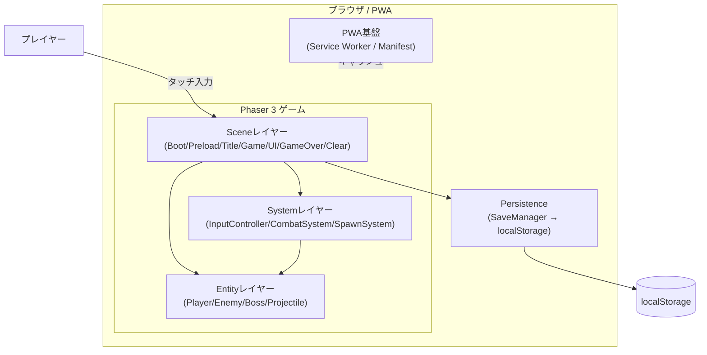
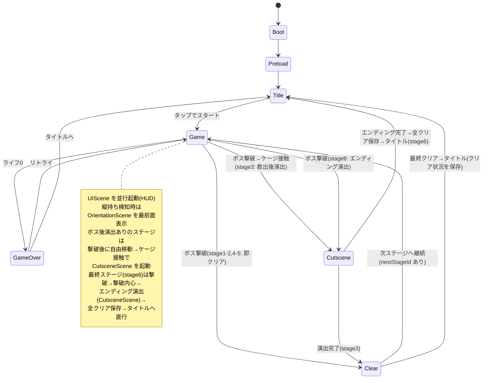
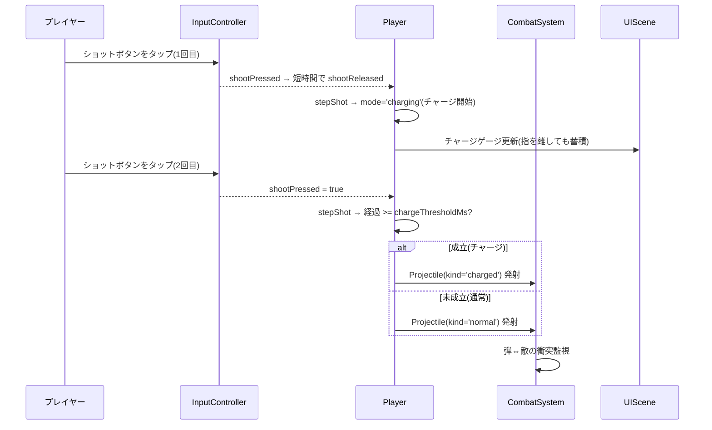
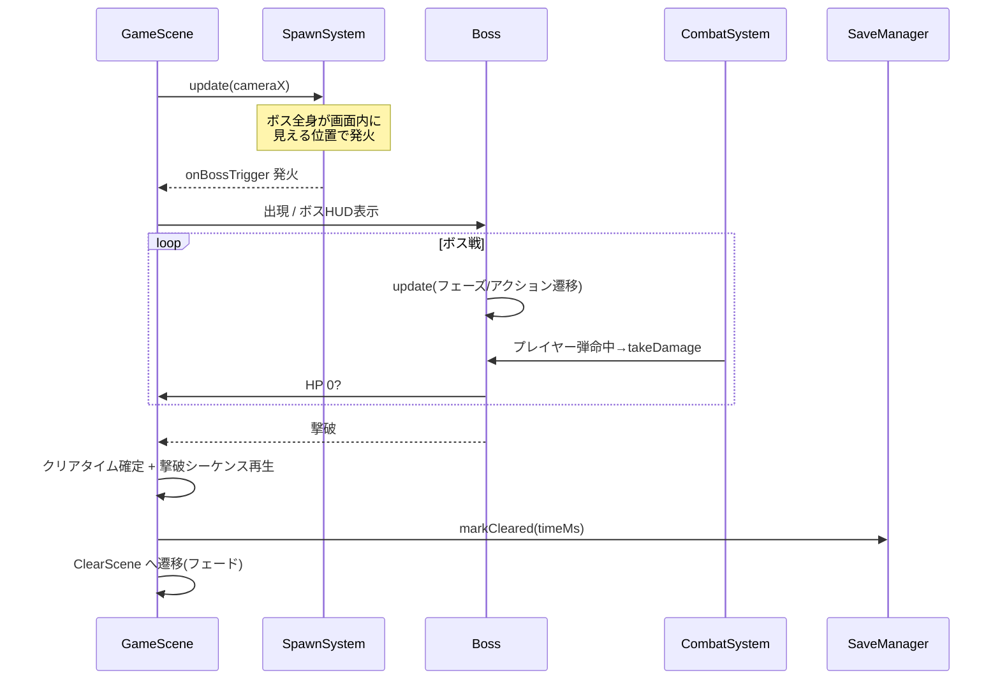

# 機能設計書 (Functional Design Document)

> 本書は `docs/product-requirements.md`(PRD)で定義した MVP 要件(P0)を、Phaser 3 ベースの PWA としてどう実現するかを定義する。MVP のスコープは「タイトル画面 + 複数ステージ(stage1 接地ボス / stage2 梯子攻略 + 飛行ボス)」「両手・横向き専用のタッチ操作」「完全オフライン(localStorage)」。

## システム構成図



- **Sceneレイヤー**: Phaser の Scene 単位で画面/状態を管理。シーン遷移で画面遷移を表現する。
- **Entityレイヤー**: プレイヤー・敵・ボス・弾など、ゲーム内オブジェクト。物理ボディと状態を持つ。
- **Systemレイヤー**: 入力解釈・戦闘判定・敵出現など、Entity をまたぐ横断ロジック。
- **Persistence**: クリア状況/設定の保存。`localStorage` のみ(サーバ通信なし)。
- **PWA基盤**: Service Worker によるオフライン動作、Manifest によるホーム画面追加。

## 技術スタック

| 分類 | 技術 | 選定理由 |
|------|------|----------|
| 言語 | TypeScript 5.x | 型安全。Phaser が型定義を提供。CLAUDE.md の技術スタック準拠 |
| ランタイム/PM | Node.js v24 / npm | devcontainer 環境の指定 |
| ゲームエンジン | Phaser 3 | 2D の定番。スプライト/アニメ/Arcade Physics/タイルマップ/サウンド/入力を内包 |
| 物理 | Phaser Arcade Physics | AABB ベースで軽量。横スクロールジャンプアクションに十分かつモバイルで高速 |
| ビルド/開発サーバ | Vite | 高速 HMR、TS 標準対応。本番ビルドの最適化 |
| PWA | vite-plugin-pwa (Workbox) | Service Worker / Manifest 生成を自動化。オフライン対応 |
| 永続化 | Web Storage API (localStorage) | サーバ不要・端末内完結。MVP の完全オフライン方針に合致 |
| アセット | CC0 等フリー素材 + 生成AI/自作 | 権利クリアなオリジナル構成 |

## ゲーム状態(シーン)構成

Phaser の Scene を画面/状態の単位とする。

| シーン | 責務 |
|--------|------|
| `BootScene` | 最小設定の初期化、Preload への遷移。表示スケール/向き設定 |
| `PreloadScene` | アセット(スプライト/タイルマップ/音)の一括ロード、ローディング表示 |
| `TitleScene` | タイトル画面(`LAST SPARK` ロゴ + 「タップでスタート」)。クリア済みフラグの表示 |
| `GameScene` | ステージ本体。プレイヤー/敵/ボス/弾/カメラ/物理を統括 |
| `UIScene` | HUD(プレイヤーライフ、ボスHP、チャージゲージ)。`GameScene` と並行起動 |
| `GameOverScene` | ゲームオーバー表示とリトライ導線 |
| `ClearScene` | ボス撃破時のクリア演出。クリア状況(ステージ単位)を保存しタイトル/次ステージへ。最終ステージ全クリアで「ALL CLEAR」を表示 |
| `CutsceneScene`(オーバーレイ) | 演出シーン。静止画的演出+交互テキスト(TERRA/RAY)+ト書き+ナレーションをタップ送りで再生し、完了後に指定遷移を呼ぶ。Stage 1 開始演出・Stage 3 救出後演出・Stage 4-5 開始演出・Stage 6 エンディングで使用(BGM は起動データで差し替え可能) |
| `OrientationScene`(オーバーレイ) | 縦持ち検知時に「横向きにしてください」案内を最前面表示 |
| `PauseScene`(オーバーレイ) | タイトル/プレイ中(ポーズ)双方から開く統合オプションメニュー。音量(BGM/SE 5段階・ミュート)、難易度(normal/hard)、ポーズ/再開、操作説明、ステージ移動(リトライ/タイトルへ戻る/ステージ選択)を1つのオーバーレイに集約。`GameScene` 上では物理を止めて `launch` し、破壊的遷移は resume 後に実行する |

## データモデル定義

> ゲームの状態は実行時の Entity が保持する。永続化対象は最小限(クリア状況・設定)に絞る。

### 永続データ: SaveData(localStorage)

```typescript
interface SaveData {
  version: number;                  // セーブ構造のバージョン(マイグレーション用、現行 4)
  clearedStages: string[];          // クリア済みステージID(全6ステージ対応)
  bestTimeMs?: Record<string, number>; // ステージ別クリア最速タイム(ミリ秒)。未クリアのステージはキーなし
  settings: GameSettings;           // ユーザー設定
}

interface GameSettings {
  muted: boolean;           // サウンドミュート(モバイル自動再生制約に配慮、既定 false)
  bgmVolume: number;        // 0.0–1.0
  seVolume: number;         // 0.0–1.0
  difficulty: 'normal' | 'hard'; // 難易度。hard は被ダメージ・敵係数を強化し、ストーリー演出を非表示
}
```

**制約**:
- 保存キーは `lastspark:save`(名前空間付き)。
- `localStorage` 利用不可・破損時は既定値で起動し、ゲーム自体は継続可能(進捗が無いだけ)。
- `version` 不一致時は、旧形式からのマイグレーションを試み、移行不能なら安全側にフォールバック(既定値で再生成)。現行構造は `version: 4`(`clearedStages` / `bestTimeMs:Record` / `settings.difficulty`)。なお当時の v3 セーブが持っていた `collectedLogs` フィールド(科学者ログ収集)は撤去済みで、余分な `collectedLogs` は読み込み時に無視する。
  - v1(`cleared:boolean` / `bestTimeMs:number`)→現行 移行: `cleared:true`→`clearedStages:['stage1']`、`bestTimeMs:number`→`{ stage1: value }`。
  - v2 / v3→現行 移行: 進捗を保持し、`settings.difficulty` 未設定なら `normal` を補完して version を引き上げる。
- API: `markStageCleared(stageId, timeMs?)` でステージ単位に記録(最速タイムのみ更新)。`markCleared(timeMs)` は `stage1` への委譲で後方互換。`isStageCleared(stageId)` で到達判定。

### 実行時モデル: 主要 Entity

```typescript
// プレイヤー(最後のロボット)
interface PlayerState {
  hp: number;               // 現在ライフ(整数)
  maxHp: number;            // 最大ライフ
  facing: 'left' | 'right'; // 向き(ショット方向に使用)
  onGround: boolean;        // 接地判定
  shotState: ShotState;     // ショット操作の状態(shotControl: idle/pending/charging/holding/postFire)
  invincibleUntil: number;  // 無敵終了時刻(ms)。被弾後の点滅無敵
}

// 弾(通常/チャージ共通)
interface ProjectileState {
  kind: 'normal' | 'charged';
  damage: number;           // kind により決定
  velocityX: number;        // 進行方向 × 速度
  owner: 'player' | 'enemy';
}

// 雑魚敵
interface EnemyState {
  hp: number;
  contactDamage: number;    // 接触ダメージ
  pattern: EnemyPattern;    // 移動/攻撃パターン識別子
}

// ボス(系統で接地/飛行を出し分ける)
interface BossState {
  hp: number;
  maxHp: number;
  phase: BossPhase;         // HP に応じた行動フェーズ
  currentAction: BossAction;
  actionEndsAt: number;     // 現在アクションの終了時刻(ms)
}

type EnemyPattern = 'walker' | 'turret';      // MVP の雑魚2種(案)
type BossPhase = 'phase1' | 'phase2';          // HP 50% で移行
// 系統共通の行動。接地は idle/move/shoot/jump/stagger、飛行は hover/move/shoot/dive/stagger、
// 収容番人(stage3)は接地 + missile(放物線ミサイル)、浄化型(stage4)は idle/move/shoot/spray/stagger、
// ECLIPSE本体(stage6 ラスボス)は idle/shoot/stagger + summon(配下召喚)を使う
// hard mode 裏ボス Shadow RAY は接地型の idle/move/shoot/jump/stagger を使う
// (missile/spray/summon は系統専用の重みテーブルに閉じる)
type BossAction = 'idle' | 'move' | 'shoot' | 'jump' | 'stagger' | 'dive' | 'hover' | 'missile' | 'spray' | 'summon';
// 接地型(stage1) / 飛行・浮遊型(stage2,5) / 重装ミサイル型(stage3 収容番人) / 巨大コア型(stage6 ECLIPSE本体)
type BossKind = 'ground' | 'flying' | 'warden' | 'core';
// 系統内の種別(任意)。'purifier'=stage4 の環境管理機(接地・浄化型・扇状の範囲攻撃)、
// 'envoy'=stage5 の ECLIPSE の使者(飛行・高速ヒット&アウェイ。FlyingBoss を ENVOY 値で流用)
type BossVariant = 'purifier' | 'envoy';
```

### パラメータ定義(チューニング値の集中管理)

> マジックナンバーをコードに散らさず、定数モジュールに集約する(難易度調整・テストを容易にする)。

```typescript
// 例: src/config/balance.ts
export const PLAYER = {
  maxHp: 16,
  moveSpeed: 160,        // px/s
  jumpVelocity: -420,    // px/s(上向き負)
  invincibleMs: 800,     // 被弾後の無敵時間
} as const;

export const SHOT = {
  normalDamage: 1,
  chargedDamage: 3,
  chargeThresholdMs: 600, // この長さ以上の長押しでチャージ成立
  normalSpeed: 420,
  chargedSpeed: 480,
  cooldownMs: 180,        // 連射間隔
} as const;

export const BOSS = {
  maxHp: 40,
  phase2HpRatio: 0.5,
} as const;
```

## コンポーネント設計

### InputController(Systemレイヤー)

**責務**:
- 横向き・両手前提のタッチ入力を、抽象的な操作意図(move/climb/jump/shoot)に変換する。
- 画面左半分=追従パッド(横変位=左右移動、縦変位=梯子昇降の `climbDir`)、右側=ジャンプ/ショットの仮想ボタンを管理する。縦は誤反応抑制のため横より大きい不感帯(`CLIMB_DEADZONE_PX`)を用い、`climbDir` は梯子に重なっている時のみ Player 側で使用する。
- 左親指=移動/昇降、右親指=ジャンプ/ショットに役割を分離する。3 ポインタのマルチタッチで移動とジャンプ・ショットを同時に扱う。キーボード(開発時、矢印 上下=昇降)もフォールバックで受ける。

**インターフェース**:
```typescript
interface InputState {
  moveDir: -1 | 0 | 1;   // -1=左, 0=停止, 1=右
  climbDir: -1 | 0 | 1;  // 梯子昇降の上下入力。-1=上(登る), 0=なし, 1=下(降りる)
  jumpPressed: boolean;  // このフレームでジャンプ入力が立ち上がったか
  jumpHeld: boolean;     // ジャンプボタン押下中(可変ジャンプ高さ制御)
  shootPressed: boolean; // このフレームでショット入力が立ち上がったか(タップ/連射の起点)
  shootHeld: boolean;    // ショットボタン押下中(連射・押下継続判定)
  shootReleased: boolean;// このフレームで離されたか(タップ確定トリガ)
}

class InputController {
  update(): InputState;          // 毎フレーム最新の入力状態を返す
  attachTouchZones(): void;      // 左右ゾーン/仮想ボタンの登録
}
```

**依存関係**: Phaser の入力(Pointer/Keyboard)、`UIScene`(追従パッド/ショットボタン描画)。

### CombatSystem(Systemレイヤー)

**責務**:
- 弾⇔敵、弾⇔ボス、プレイヤー⇔敵/ボス/敵弾 の衝突処理とダメージ適用。
- 被弾時の無敵・点滅、撃破時のヒット表現発火。
- `GameSettings.difficulty` に応じて、プレイヤー被ダメージ倍率を適用する。

**インターフェース**:
```typescript
class CombatSystem {
  registerColliders(scene: GameScene): void;
  applyDamage(target: Damageable, amount: number): void;
}
```

**依存関係**: Arcade Physics、Entity 群、`UIScene`(HP 反映)。

### SpawnSystem(Systemレイヤー)

**責務**: ステージ進行(カメラ位置/トリガ)に応じた雑魚敵の出現、ボス戦エリアへの到達検知。

```typescript
class SpawnSystem {
  loadStage(stageId: string, difficulty?: DifficultyMode): void; // 敵配置データ・敵数・難易度係数の読み込み
  update(cameraX: number): void;       // 進行に応じた出現制御
  onBossTrigger(cb: () => void): void; // ボス戦突入トリガ
}
```

**ボス戦突入の条件**: ボス戦(出現・BGM切替・HPバー表示・アリーナ固定)は、**ボスの全身が画面内に見える位置までカメラが進んでから**開始する。`StageData.bossTriggerX` は設計上の最短地点として尊重しつつ、`bossSpawn.x + ボス半幅 + 余白` との遅い方を採用する(ボスが画面外のまま戦闘が始まる体験を防ぐ。ボス系統ごとの幅は `BOSS` / `FLYING_BOSS` から引くため、ステージ追加時も自動で成立する)。

### ストーリーテリング基盤(テキスト表示)

> ストーリー本文は `docs/story.md`(北極星)を正本とし、ゲーム内表示はその確定テキストを反映する。設計の責務分割は「ジオメトリ(`config/stages.ts`)とテキスト(`config/story/`)を混ぜない」。

**テキスト種別(4種)**: ゲーム内テキストは `StoryTextKind`(`eclipseVoice` / `rayInner` / `stageIntro` / `terraLine`)で区別し、種別ごとに表示位置・色・フォント・一時停止要否を変える(話者ラベルは出さず、見た目だけで「誰の言葉か」を判別させる)。kind→スタイルのマップ `TEXT_STYLES` は純粋ロジック(`systems/storyDirector.ts`)に置き、描画(`ui/StoryOverlay.ts`)と共有する。「物語を語る口は4つ」という `docs/story.md`(2026-06-14 再設計)の方針に対応する(旧 `scientistLog`=科学者ログは全廃済み。型・セーブ・トリガー機構いずれも実装から撤去済み)。

**StoryDirector(純粋ロジック)**: `resolveStoryEvent(story, event)` が `StoryEvent`(`stageStart` / `bossIntro` / `inner`)を表示要求 `TextRequest[]` に変換する。Phaser 非依存でユニットテスト可能(`bossAi.ts` 等と同方針)。確定テキストは `config/story/stageN.ts`(`StageStory`)に持ち、`getStageStory(stageId)` で引く。

**StoryOverlay(描画)**: `UIScene` に常駐し、`TextRequest` のキューを順に再生する。表示挙動は2段構成: **(1) ステージ開始テキスト(`stageIntro`)のみ**画面中央に出して `GameScene` を `scene.pause` し、**タップで進む**(ステージ開始の合図。止まっている間は移動/ショットの誤タップが起きないので安全)。**(2) それ以外のステージ中テキスト(ECLIPSE の語りかけ/RAY内心/TERRA)**は動きを止めず画面上部に出し、本文の長さに応じた読了時間(`readingDurationMs`)で自動的に次へ進む(タップでは閉じない=プレイ中の移動/ジャンプ/ショットやボス出現時の連射で「読む前に消える」のを防ぐ)。kind→位置/一時停止要否は `TEXT_STYLES` が持つ。`GameScene` → `UIScene` の表示要求は HUD と同じく registry(`STORY.pending` 配列)へ積み、`UIScene.update` が毎フレーム drain して overlay へ渡す。cross-scene イベントだと UIScene の起動(create)が GameScene の発火より遅れて開始テキストを取りこぼすため、起動順に依存しない registry 方式にしている(`GameScene.create` は開始時に pending を空にしてから積む)。

**難易度による表示ポリシー**: `normal` は従来どおりストーリー本文・開始演出・救出演出・エンディング演出を表示する。`hard` は純粋に手ごたえのあるゲームプレイを楽しむモードとして、`shouldShowStoryForDifficulty('hard') === false` により `GameScene` 側で StoryOverlay への表示要求、開始/ボス後/エンディングの `CutsceneScene` 起動、ボス撃破後内心をすべて抑止する。Stage 6 hard ではエンディング演出を経由せず `ClearScene` に遷移し、`stageId` を渡して既存のクリア保存を行う。

> **補足(科学者ログ機構は撤去済み)**: 旧版には `StageData.logTriggers?` に基づく `LogTrigger`(任意接触で科学者ログ断片を発火するオーバーラップ判定)があったが、`docs/story.md`(2026-06-14 再設計)の「ログ全廃」に伴い、型・セーブ(`collectedLogs`)・トリガー機構ともに実装から撤去済み。現行の物語伝達は前述4種のテキスト + カットシーンのみ。

**演出シーン(CutsceneScene)とボス後フロー**: ボス撃破後に物語の転換(Stage 3 の TERRA 救出など)を見せるための独立シーン。`StageData.postBossCutsceneKey?` と `cage?` を持つステージは、ボス撃破→撃破演出→**ケージ解錠→自由移動→ケージ接触で `CutsceneScene` 起動→クリア処理**の順で流れる(`GameScene.handleClear` が分岐)。`postBossCutsceneKey` を持たない Stage 1-2 は従来どおり撃破→即クリア(後方互換)。`CutsceneScene` は `scriptKey`(`config/story/cutscenes.ts` の `Cutscene`)を受け取り、TERRA のセリフ↔RAY の内心↔ト書き(`direction`)をタップ送りで 1 行ずつ再生し、`onComplete` で完了後の遷移を呼ぶ。scriptKey 差し替えで Stage 4-6 の演出にも再利用する。

### ステージ構成と地形ギミック(複数ステージ / すり抜け床 / 梯子)

#### StageData(ステージ定義)

各ステージは `StageData` としてコード定義し、`getStageData(stageId)` で引く。`GameScene.init({ stageId })` で開始ステージを受け、`nextStageId` を辿って stage1 → stage2 → … → stage6 と続ける(`nextStageId` 無し=最終ステージ。未実装の次ステージへは接続しない)。主なフィールドは次のとおり。

| フィールド | 役割 |
|-----------|------|
| `id` / `width` | ステージ ID / ステージ全幅 |
| `playerStart` | プレイヤー初期位置(中心) |
| `platforms` | 地形(地面/浮遊足場) |
| `ladders?` | 梯子(任意。未定義なら梯子なし) |
| `hazards?` | ダメージ床(任意。stage4 の毒だまり。重なり判定のみ・物理衝突なし) |
| `enemies` | 雑魚敵の配置 |
| `bossTriggerX` / `bossSpawn` / `bossArenaMinX` | ボス戦突入の最短地点 / ボス出現位置 / アリーナ左端 |
| `bossKind?` | ボス系統。未定義=接地型(`ground`)、stage2=`flying` |
| `bossVariant?` | 系統内の種別。`purifier`(stage4)/ `envoy`(stage5) |
| `bossConfig?` / `bossRig?` | ボス固有チューニング / 描画リグ系統(任意) |
| `cage?` | 収容ケージ(任意・中心座標)。stage3 のみ。撃破後に解錠し接触で救出演出 |
| `introCutsceneKey?` | ステージ開始時に再生する演出スクリプトキー(任意) |
| `introCutsceneCoversStartText?` | 開始演出が開始テキスト(stageIntro+開始内心)を兼ねるか(任意。stage1=true) |
| `postBossCutsceneKey?` | ボス撃破後に再生する演出キー(任意。stage3 の救出など) |
| `endingCutsceneKey?` | 撃破後のエンディング演出キー(任意。stage6=最終。ClearScene を経由せず全クリア保存→タイトル) |
| `backgroundColor?` | カメラ背景色(任意・CSS 色)。未定義時はテーマの地平線色(`skyBottom`) |
| `nextStageId?` | クリア後に続けて開始する次ステージ ID(任意) |

**ボス生成の出し分け**: `GameScene.spawnBoss` が `bossKind` / `bossVariant` に応じて Entity を生成する。飛行型・コア型は重力なしで空中に滞空するため地面コライダを付けず、接地型・warden は地面コライダを付ける。

- `bossKind='flying'`(stage2, stage5)→ `FlyingBoss`。`bossVariant='envoy'`(stage5)は高速型 `ENVOY`、それ以外(stage2)は既定 `FLYING_BOSS`。
- `bossKind='core'`(stage6)→ `CoreBoss`(配下召喚のため敵グループ等のコンテキストを注入)。
- `bossKind='warden'`(stage3)→ `WardenBoss`(重装ミサイル型 `CONTAINMENT_WARDEN`)。接地型なので地面コライダを付ける。
- `bossVariant='purifier'`(stage4・接地型)→ `PurifierBoss`(浄化型・扇状の範囲攻撃 `spray`)。
- 上記いずれにも該当しない(stage1 など)→ 既定の接地ボス `Boss`(`bossConfig` / `bossRig` を反映)。
- hard mode の stage6 では `CoreBoss` 撃破直後に `ShadowRayBoss` を追加出現させる。ECLIPSE の召喚雑魚と敵弾は裏ボス開始前に掃除し、RAY と同サイズの接地型決闘へ切り替える。normal では出現しない。
- `introCutsceneKey` を持つステージ(stage4 等)はステージ開始時に `CutsceneScene` を再生してから開始テキストへ進む。

**ステージ背景**: ストーリー世界観に連動した手続き生成のパララックス背景(空グラデーション + 多層シルエット)で表現する。テーマ(空色・アクセント色・シルエット種別・パララックス係数)は `src/config/stageBackground.ts` が `stageId` から引き(`getStageBackground`、純データ+決定論ロジックで Phaser 非依存)、`src/systems/backgroundPainter.ts` が `paintStageBackground` で描画する(アセット追加なし、既存のプレースホルダ手続き生成を踏襲)。背景は depth 負値でゲームプレイ要素より背面に置き、全幅描画 + `setScrollFactor<1` でカメラ追従・ボス戦の bounds 縮約・RESIZE に追随する(`GameScene.buildBackground` が `create` で一度だけ構築)。`backgroundColor` はカメラのベース塗り(地面下/奈落の保険)。

**すり抜け床(ワンウェイ床)**: 地形は高さで `height>40`=地面(全面衝突)、それ以下=浮遊足場(ワンウェイ)に分け、別グループにする。プレイヤー/敵×足場の collider は `processCallback` を持ち、純粋関数 `shouldLandOnOneWay(bottom, velY, platformTop)`(下降中かつ足元が床上端付近)が真の時だけ衝突を有効化する。これにより足場は「上から着地・下から通過」になる(地面は従来どおり全面衝突)。接地ボスは地面のみと衝突する(飛行ボスは重力を切って滞空するため地形と衝突しない)。

**梯子(ladder)**: `StageData.ladders` の矩形を `GameScene.buildLadders` が見た目(タイル)として敷き、矩形配列を `Player.setLadders` へ渡す(物理衝突はさせない)。Player は純粋関数 `overlapsAnyLadder` / `resolveLadderState` / `climbVelocity` で把持状態を判定し、把持中は重力を切って(`setAllowGravity(false)`)上下入力で鉛直移動する。離脱時に重力を必ず戻す。梯子昇降中はプレイヤーの足場 collider を抑制し、ワンウェイ床を貫通して登り降りできる(梯子上端=直上の足場上端に揃え、登り切ると足場に乗れる動線)。これらの純粋ロジックは `systems/playerMovement.ts` に集約しユニットテスト可能にする。

### EffectsManager(Systemレイヤー)

**責務**: 戦闘演出(撃破パーティクル爆発・カメラシェイク・ヒットストップ・ボス撃破シーケンス)を統括する。`GameScene` が所有し、`CombatSystem` のコールバックから呼ばれる。チューニング値は `src/config/effects.ts` に集約する。

```typescript
class EffectsManager {
  explodeSmall(x, y): void;   // 雑魚撃破の小爆発
  explodeBoss(x, y): void;    // ボス撃破バーストの大爆発
  playerDamaged(): void;      // 被弾の手応え(カメラシェイク)
  bossDeathSequence(x, y, onComplete): void; // 多段爆発→余韻→クリア遷移
}
```

**演出ポリシー(プレイテストで確定した制約)**:
- **画面全体のフラッシュ(`camera.flash`)は使わない**。点滅が酔い・不快感を誘発するため。被弾の視覚フィードバックはカメラシェイク+リグの白フラッシュ(`setTintFill`)+ライフバーの点滅で伝える。
- **ヒットストップ(`physics.world.pause`)は戦闘中に使わない**。ワールド全体が止まるため、ダメージを受けていないプレイヤーの操作まで固まり操作感を損なう。許容するのはボス撃破の瞬間(戦闘終了後の演出)のみ。
- ボス撃破時はプレイヤーを静止(`setVelocityX(0)`)させる。撃破後は入力反映が止まるため、残速度の滑走をカメラが追従して画面が流れるのを防ぐ。
- クリアタイムは撃破の瞬間に確定する(約1.4秒の撃破シーケンスをベストタイムに含めない)。

### SoundManager(Systemレイヤー)

**責務**:
- 外部音源ファイルを使わず、`src/config/audio.ts` の合成仕様を Web Audio で手続き生成して再生する(知財・コンプライアンス方針に準拠)。
- SE(効果音)13 種の単発再生と、BGM 5 トラックのループ再生・切替を担う。BGM は docs/story.md「BGM方針」の4シーンに対応:
  - `title`(導入の浮遊感) / `stage`(探索=アンビエント・ドローン) / `stageWarm`(TERRA同行後の温もり) / `boss`(無機質な機械音) / `ending`(弦・パッド系の余韻)
  - 探索 BGM は `selectExplorationBgm(clearedStages)` で、Stage 3 クリア(TERRA同行)以降は `stage`→`stageWarm` へ切り替わる。エンディングは `CutsceneScene` の起動データ `bgm` で `ending` を指定。
  - 各トラックは任意で **持続ドローン**(`drone`: 低音パッド)と **デチューン**(`detuneCents`: 2声のコーラス感)を持ち、アンビエントな土台や弦の厚みを表現する。
- `GameSettings`(`muted` / `bgmVolume` / `seVolume`)に従って音量・ミュートを反映(ドローン・デチューン声も bgm チャンネル経由で追従)。iOS Safari 等の自動再生制約に備え、初回ポインタ操作までは無音とし、操作を起点にオーディオを解放する。

```typescript
class SoundManager {
  unlock(): void;                 // 初回ユーザー操作でオーディオ解放
  playSe(key: SeKey): void;       // 単発SE(jump/shootNormal/bossHit など13種)
  playBgm(key: BgmKey): void;     // BGMループ再生・切替(title/stage/stageWarm/boss/ending)
  stopBgm(): void;
  applySettings(s: GameSettings): void; // ミュート/音量の反映
}
```

**依存関係**: Web Audio API、`config/audio.ts`(SE/BGM の合成仕様)、`GameSettings`。純粋な合成ロジック(音量計算・周波数・スケジューリング・デチューン倍率 `centsToRatio`・探索 BGM 選択 `selectExplorationBgm`)は `systems/soundSynth.ts` に分離する。

### Player / Enemy / Boss / Projectile(Entityレイヤー)

各 Entity は Phaser の `Arcade.Sprite` を継承し、自身の状態(上記モデル)と振る舞い(`update`)を持つ。なお、キャラの物理(`Arcade.Sprite`)と見た目は分離しており、頭・胴・腕・脚を関節化した `CharacterRig`(`entities/CharacterRig.ts`)へ表示を委譲する(詳細は `docs/architecture.md` の「見た目リグの分離」を参照)。

```typescript
class Player extends Phaser.Physics.Arcade.Sprite {
  applyInput(input: InputState): void; // 入力に基づく移動/ジャンプ/発射
  takeDamage(amount: number): void;
  // ショット操作(タップ=チャージ、再タップ=発射、長押し=連射)は
  // 純粋状態機械 systems/shotControl.ts(stepShot)で解釈する。
}

class Boss extends Phaser.Physics.Arcade.Sprite {
  update(time: number, playerX: number): void; // フェーズ/アクション遷移
  takeDamage(amount: number): void;
}

// 飛行/浮遊型ボス。Boss を継承し、被ダメ/けぞり/フェーズ/撃破/アリーナ拘束を再利用する。
// 飛行固有値(滞空高度・バブ・急降下)をコンストラクタで差し替え、stage2(既定 FLYING_BOSS)と
// stage5 の使者(高速型 ENVOY・bossVariant='envoy')で同一ロジックを共有する
class FlyingBoss extends Boss {}
// 収容番人(stage3・重装ミサイル型)。接地型のまま固有アクション missile(放物線アーティラリー)を持つ
class WardenBoss extends Boss {}
// 浄化型ボス(stage4・環境管理機)。接地型のまま spray(扇状の範囲攻撃)を持つ
class PurifierBoss extends Boss {}
// ECLIPSE本体(stage6 ラスボス)。非人型の巨大コア。重力なしで浮遊・静止し、
// phase1=summon(配下 Enemy の動的召喚)で支援型、phase2=shoot 主軸の直接攻撃型。
// ただし phase2 でも summon を継続し、HP が減っても雑魚召喚は止まらない(盤面圧で実質的に硬くする)
class CoreBoss extends Boss {}
// hard mode 専用の裏ボス。RAY と同じ 28x40 の人型で、Boss の接地行動を再利用する。
class ShadowRayBoss extends Boss {}
```

#### ボス系統(コンフィグ駆動 + 継承)

`Boss` は設定オブジェクト(`BossConfig`)・リグ系統・重力有無をコンストラクタで受け取るコンフィグ駆動とし、既定引数では従来どおりの接地ボス(stage1)になる。各系統は `Boss` を継承し、被弾・けぞり・フェーズ・撃破・HUD 連動・アリーナ拘束といった共通ロジックを再利用しつつ、`beginNextAction / executeAction / clampToArena / updateRig` の一部のみを上書きする。

```
Boss(接地型・stage1 / 既定 BOSS)
 ├─ FlyingBoss   ← 飛行/浮遊型(stage2 既定 FLYING_BOSS、stage5 使者 ENVOY)
 ├─ WardenBoss   ← 収容番人(stage3・重装ミサイル型 CONTAINMENT_WARDEN)
 ├─ PurifierBoss ← 浄化型(stage4・接地のまま spray)
 ├─ CoreBoss     ← ECLIPSE 本体(stage6 ラスボス・非人型コア)
 └─ ShadowRayBoss← hard mode 裏ボス(stage6・ECLIPSE 撃破直後・RAY 同サイズ)
```

- **接地型 `Boss`(stage1)**: 既定 `BOSS`。`idle/move/shoot/jump/stagger` で戦う標準系統。
- **飛行型 `FlyingBoss`(stage2, stage5)**: 重力を切って空中の基準高度に滞空し(上下バブ)、`hover`(滞空)・`move`(高度を保った左右展開)・`shoot`(プレイヤーの高さへ水平発射)・`dive`(プレイヤーへ急降下し、その後高度復帰)で戦う。`dive` の最下点は地上プレイヤーのショット高さに重なるよう調整し、地上からの攻撃で撃破可能にする。飛行固有値(滞空高度・バブ・急降下)をコンストラクタで差し替え、stage2(既定 `FLYING_BOSS`)と stage5 の使者(高速型 `ENVOY`・`bossVariant='envoy'`)で同一ロジックを共有する。
- **重装型 `WardenBoss`(stage3)**: 接地型(重力あり)のまま `CONTAINMENT_WARDEN` で生成し、接地移動・ジャンプ・通常射撃を再利用しつつ固有アクション `missile`(プレイヤー周辺へ放物線で降り注ぐアーティラリー)を足す。`beginNextAction` を上書きし、専用の重みテーブル(`bossAi` の `WARDEN_WEIGHTS`)で抽選する。水平に飛ぶ stage1 の通常弾とは軌道・脅威が異なり、移動による回避を強制する。
- **浄化型 `PurifierBoss`(stage4)**: 接地型(重力あり)のまま `beginNextAction` のみ上書きし、浄化型専用の重みテーブル(`bossAi` の `PURIFIER_WEIGHTS`)で抽選する。`jump` を持たず、`spray`(プレイヤー方向の水平を中心に扇状へ複数弾を散布する範囲攻撃=毒霧スプレー)を主軸に `move`/`shoot` を織り交ぜる。`spray` の弾数・開き角・速度は `PurifierBossConfig.spray` でパラメータ化し、既存の弾プール/`Projectile` を流用する(発射後に鉛直速度を与えて扇形にする)。
- **コア型 `CoreBoss`(stage6 ラスボス)**: `ECLIPSE_CORE` / `CoreBossConfig`。非人型の巨大コアで、重力を切って空中に静止し(移動なし)、人型リグの代わりに専用ビジュアル(八角形の装甲+発光する眼)を描く。`beginNextAction` を上書きして `CORE_WEIGHTS` で抽選し、phase1 は固有アクション `summon`(既存 Enemy/敵グループを流用して配下を動的生成。場の上限 `summonMaxActive` を超えない)で支援型、phase2 は `shoot` を主軸にしつつ `summon` も継続して盤面圧を残す直接攻撃型へ切り替わる。ハードで過剰な圧にならないよう、弾ダメージ・弾速・phase2 の行動間隔・召喚密度は回避余地が残る範囲に調整する。さらに、エクリプス戦で同伴する召喚雑魚は hard 中でも HP とプレイヤーへの接触/弾ダメージを normal 相当に固定し、道中 hard 雑魚の強化とは切り離す。
- **影型 `ShadowRayBoss`(hard mode 裏ボス)**: `SHADOW_RAY`。hard の stage6 で ECLIPSE 本体を倒した直後だけ出現する。物理サイズは RAY と同じ `PLAYER.width` / `PLAYER.height`(28x40)で、専用リグ `bossShadowRay` はプレイヤーと同じ人型パーツ構成を持つが、赤紫の反転パレットと別パーツキーで本人と区別する。小さい当たり判定のため HP は ECLIPSE より低くし、短い行動間隔・高速弾・ジャンプで「もう一戦」の手ごたえを作る。出現前に ECLIPSE の召喚雑魚と敵弾を消し、理不尽な重なりを避けて 1 対 1 の決闘へ移行する。

系統別チューニングは `balance.ts` の `BOSS` / `FLYING_BOSS`(`FlyingBossConfig`)/ `CONTAINMENT_WARDEN`(`WardenBossConfig`)/ `PURIFIER`(`PurifierBossConfig`)/ `ECLIPSE_CORE`(`CoreBossConfig`)/ `SHADOW_RAY` に分離する。

### SaveManager(Persistence)

**責務**: `SaveData` の読み書き、既定値生成、バージョン検証。

```typescript
class SaveManager {
  load(): SaveData;             // 失敗時は既定値を返す(throw しない)
  save(data: SaveData): void;   // localStorage 不可時は黙って no-op + 警告ログ
  markCleared(timeMs: number): void;
  updateSettings(s: Partial<GameSettings>): void;
}
```

## 画面遷移図



## ユースケース(主要フロー)

### UC-1: チャージショットを撃つ



**フロー説明**:
1. ショットボタンの 1 回目タップ(短押し→離す)で `shotControl` が `charging` に遷移し、チャージ開始時刻を記録。指を離してもゲージは蓄積し続ける。
2. `UIScene` がチャージゲージを伸ばし、しきい値到達で発光(視覚フィードバック)。
3. 2 回目タップ(`shootPressed`)で経過時間を判定し、`chargeThresholdMs` 以上ならチャージ弾、未満なら通常弾を発射。
4. ショットボタンを `holdToAutoFireMs` 以上押し続けた場合は、チャージせず通常弾を `cooldownMs` 間隔で連射する。`burstSize` 発撃つごとに `burstPauseMs` の小休止を挟み、連射にリズムを与える。
5. いずれも `cooldownMs` の連射間隔を超えていない場合は発射しない。

### UC-2: ボス戦突入〜撃破



**撃破時の流れ**: 撃破の瞬間にクリアタイムを確定し、プレイヤーを静止させたうえで `EffectsManager.bossDeathSequence`(多段爆発+大シェイク)を再生、完了後にフェードで `ClearScene` へ遷移する(演出ポリシーは EffectsManager の節を参照)。

## ボス行動設計(アルゴリズム)

**目的**: ボス1体で「単調でない」行動を成立させる(PRD 受け入れ条件)。HP に応じた2フェーズ + 重み付きアクション選択。

### フェーズ遷移
- `phase1`: HP > 50%。アクション間隔は標準。
- `phase2`: HP <= 50%(`BOSS.phase2HpRatio`)。アクション間隔短縮 + `jump` の頻度増で攻勢を強める。

### アクション選択ロジック
現在アクションが終了(`actionEndsAt` 到達)したら、次アクションをフェーズ別の重みで抽選する。直前と同じ攻撃の連続を避ける。

```typescript
function pickNextAction(phase: BossPhase, last: BossAction): BossAction {
  // フェーズ別の重みテーブル(合計は任意、相対値)
  const weights: Record<BossPhase, Partial<Record<BossAction, number>>> = {
    phase1: { move: 35, shoot: 35, idle: 15, jump: 15 },
    phase2: { move: 30, shoot: 35, idle: 5, jump: 30 },
  };
  const table = weights[phase];
  // 直前と同一アクションは重みを半減(連続を抑制)
  const adjusted = Object.entries(table).map(([action, w]) =>
    [action, action === last ? w * 0.5 : w] as [BossAction, number]
  );
  return weightedRandom(adjusted); // 重み付き抽選
}
```

- `move`: 前後に移動してペースする(プレイヤーへ一方的に詰めず、間合いを取り直す)。アリーナ端では内側へ向く。
- `shoot`: プレイヤー方向へ弾を発射(phase2 では弾数/頻度を上げる)。
- `jump`: その場/前後ドリフトしながらジャンプする(縦の動きで単調さを崩す)。重力で着地する。
- `stagger`: 一定ダメージ蓄積で短時間のけぞり(反撃チャンス)。
- `idle`: 短い静止(プレイヤーに行動を読ませる間)。

> ※ 突進(`charge`)は MVP の調整で廃止し、`jump` と前後移動(`move`)に置き換えた。

## UI設計(HUD / タッチUI)

### HUD(UIScene)

| 項目 | 説明 | 表示 |
|------|------|------|
| プレイヤーライフ | 現在/最大HP | 左上のエナジーバー(セグメント式) |
| ボスHP | ボス戦中のみ | 画面下部または上部のボスゲージ |
| チャージゲージ | チャージ蓄積量 | ショットボタン付近に円/バーで表示、しきい値で発光 |

### タッチUI(横向き・両手専用)

```
（横向き / 両手持ち）
┌───────────────────────────────────────────────────────┐
│  プレイ領域(ボス・弾幕はこの上側にのみ描画される)        │
│   ◀ 歩行 ▶ (追従パッド/左手)                            │
├───────────────────────────────────────────────────────┤
│  下部コントロール帯(タッチ時のみ)   ◯ショット ◯ジャンプ │ ← 右手親指
└───────────────────────────────────────────────────────┘
```

- 左の追従パッドは触れた箇所を原点とし、横変位で左右移動する(移動専用)。
- **下部コントロール帯(レターボックス)**: 純タッチ端末では画面下部に仮想ボタン専用の帯を設け、ゲーム描画(カメラ viewport)を帯の上へ収める。これにより「指が乗る帯」と「ボス・弾幕が見えるプレイ領域」を物理的に分離し、ボス戦で右下ボタンに乗せた指がボスを隠す問題を防ぐ。帯高さ・端末判定は `src/config/controlBand.ts` に集約し、カメラ(`GameScene`)・描画(`UIScene`/`TouchControls`)・入力判定(`InputController`)が同じ値を共有する。判定は `(pointer: coarse)` かつ `(any-pointer: fine)` 無し(=マウス等の精密ポインタを持たない純タッチ端末)を条件とし、**タッチ対応PCやマウス併用端末・デスクトップでは帯を出さずフル画面で従来挙動を維持**する。
  - **ズーム倍率は帯の有無に関わらず「画面全体の高さ」基準を維持**する(`zoom = scale.height / GAME_HEIGHT`)。帯はあくまで viewport を下から削るだけとし、世界の見かけの大きさを変えない。これにより「帯ぶん世界が縮小して見える」問題と「`displayWidth` 変化でボストリガーがズレる」問題を同時に防ぐ(帯ぶん縦の可視範囲が減るが、隠れるのは地面より下=落下域中心)。
  - 帯の縦割合は控えめ(`CONTROL_BAND_RATIO`)にし、ボタンが収まる最小高さ(`CONTROL_BAND_MIN_PX`)まで狭めてプレイ領域を広く保つ。
- ジャンプ/ショットの 2 ボタンは帯の縦中央に水平に並べ、画面右側に集約する(`src/config/touchLayout.ts`)。両ボタンとも左手の移動操作と干渉せず、サイズ/透明度は実機調整。
  - **帯内のボタン半径は「押下フィードバックの拡大(`pressedRadiusScale`)込みで帯に収まる大きさ」へ自動で切り詰める**。帯の高さが十分なら通常半径のまま。固定半径だと押下拡大時に画面下端から切れるため、レイアウト算出時に保証する。
- ショット操作: 1 回目タップでチャージ開始(離してもゲージ蓄積)、2 回目タップで発射。長押しはチャージせず通常弾を連射(`SHOT.burstSize` 発ごとに `SHOT.burstPauseMs` の小休止)。
- 移動(左親指)とジャンプ/ショット(右親指)を別ポインタで同時操作できる。
- 縦持ち検知時は `OrientationScene` を重ね、横向きへの回転を促す。

### カラーコーディング(世界観: 暗め基調 + 発光アクセント)
- 背景/廃墟: 低彩度の暗色。ステージごとに空グラデーションとシルエットのテーマを変え、世界観を出し分ける(崩れた都市=錆びた夕暮れ / 立坑=工業の鋼青 / 収容施設=冷たい白青 / 汚染地帯=毒の黄緑 / 外縁部=金属の青 / 支配中枢=漆黒に赤い核光)。
- プレイヤーのコア/弾/敵コア: ネオン発光色(グロー/明度差で表現)。
- チャージ完了: 発光色を強めて成立を明示。

### オプションメニュー(統合設定UI)

タイトル画面とプレイ中(ポーズ)の双方から開く共通オーバーレイ(`PauseScene` + `src/ui/optionsMenu.ts`)。設定の実体は `GameSettings` で、`SaveManager` により永続化し `SoundManager.applySettings` で音量を即時反映する。

- **音量**: BGM/SE を連続スライダーではなく 5 段階ボタン(`src/ui/volumeSteps.ts`)で調整し、ミュートを切替。量子化・上下限・往復一致を純関数化してテスト可能にし、タッチ/マウス/キーボードのいずれでも操作できる(Phaser に標準スライダーが無い問題の現実解)。
- **難易度**: `normal` / `hard` を切替。`hard` はプレイヤー被ダメージ、雑魚敵 HP、walker 速度、turret 発射間隔に係数を掛け、エリア探索中の道中雑魚配置数も増やす。さらに、ゲームプレイ集中モードとしてストーリー本文・開始/救出/エンディング演出を表示しない。stage6 では ECLIPSE 撃破直後に RAY 同サイズの裏ボス `ShadowRayBoss` を追加出現させる。設定は保存され、新規開始・リトライ・次ステージから反映される。
- **ポーズ/再開**: プレイ中は `PauseButton` から開き、ゲームを一時停止する。停止は物理ステップ境界に逃がし、再開・破壊的遷移(リトライ/タイトル等)は必ずポーズ解除後に行う。
- **操作説明**: 操作一覧を `src/ui/controlsData.ts` のデータから表示。
- **ステージ移動**: リトライ / タイトルへ戻る / ステージ選択へ遷移。
- メニュー生成は `stageSelect` の UI 流儀を踏襲し `optionsMenu.ts` 内のパネル生成関数として実装する(純ロジックは `volumeSteps.ts` / `controlsData.ts` に分離)。

## アセット / ファイル構造(ランタイム読み込み)

```
public/assets/
└── cutscenes/    # カットシーン背景の SVG（唯一の外部アセット）
```

- スプライト/地形/HUD は外部素材を持たず、`PreloadScene` が実行時に Phaser の図形描画でテクスチャを手続き生成する。キャラの見た目は `config/characterRig.ts` のリグ定義から組み立てる。
- ステージは Tiled 等の外部マップを使わず、`src/config/stages.ts` の `STAGES` テーブルに `StageData`(地形・敵配置・ボストリガー等)をコード定義し、`SpawnSystem` が `stageId` で `getStageData` を引く。
- **サウンドは外部音源ファイルを持たない**。SE/BGM は `src/config/audio.ts` の合成仕様から `SoundManager` が Web Audio で手続き生成するため、`audio/` アセットは不要(知財方針にも合致)。

## パフォーマンス最適化

- **オブジェクトプール**: 弾・ヒットエフェクトは生成/破棄を繰り返すためプールで再利用し GC を抑制。
- **テクスチャアトラス**: スプライトをアトラス化しドローコールを削減。
- **Arcade Physics 限定**: 重い物理(Matter)は使わず AABB のみでモバイル 60fps を狙う。
- **オフスクリーン非更新**: 画面外の敵は更新/描画を抑制(必要範囲のみアクティブ化)。
- **Service Worker キャッシュ**: 2回目以降の起動を高速化。
- **ポストFX の段階的有効化**: プレイ画面(`GameScene` 本体カメラ)に色調補正/ブルーム/ビネットを適用し、カットシーン(厚塗り一枚絵)との質感差を縮める。ただし postFX は WebGL 専用で bloom は塗りつぶし負荷が高いため、`src/config/graphicsQuality.ts` の `resolveGraphicsQuality({webgl, dpr})` で有効可否を集約判定する。Canvas フォールバック時は全FX無効、生 DPR が `BLOOM_MAX_DPR`(=2)を超える高密度端末では bloom のみ無効化し、軽量な色調補正/ビネットを残して 60fps を守る。HUD/ストーリーテキストは別カメラ(`UIScene`)描画のため postFX の影響を受けない。

## セキュリティ考慮事項

- **外部通信なし**: MVP はサーバ通信を行わず、外部送信による情報漏洩リスクを持たない。
- **機密情報の非保持**: API エンドポイント/キー等をソース・ドキュメントに含めない(該当機能なし)。
- **localStorage の扱い**: 保存値は信頼境界内の自端末データのみ。読み込み時は型/バージョン検証し、不正値は既定にフォールバック(改ざんされても進行不能にならない)。
- **知的財産**: キャラ・スプライト・名称・音楽はオリジナル or CC0 等の商用利用可ライセンスに限定。

## エラーハンドリング

| エラー種別 | 処理 | プレイヤーへの表示 |
|-----------|------|-----------------|
| アセット読み込み失敗 | リトライ後、不可なら代替表示でフォールバック | "読み込みに失敗しました。再読み込みしてください" |
| localStorage 利用不可/破損 | 既定値で起動、保存は no-op(警告ログのみ) | 表示なし(進捗が保存されないだけ、プレイは継続) |
| 縦持ち(非対応の向き) | `OrientationScene` を表示、ゲームを一時停止 | "端末を横向きにしてください" |
| サウンド自動再生ブロック | 初回タップ後にオーディオ解放、それまで無音 | 表示なし(タップで自然に解放) |
| 想定外の実行時例外 | 当該シーンを安全に停止しタイトルへ復帰 | "エラーが発生しました。タイトルに戻ります" |

## テスト戦略

### ユニットテスト
- `pickNextAction`(ボス行動抽選): 直前アクションの連続抑制、フェーズ別に許可アクションが選ばれること。
- チャージ判定(`chargeThresholdMs` 境界): しきい値直前=通常弾、しきい値以上=チャージ弾。
- `SaveManager`: 既定値生成、バージョン不一致のフォールバック、localStorage 例外時に throw しないこと。
- ダメージ適用/無敵時間: 無敵中は重複ダメージを受けないこと。

### 統合テスト
- 入力 → プレイヤー移動/ジャンプ/発射の一連が `InputState` 経由で正しく反映される。
- 弾⇔敵/ボスの衝突でHPが減少し、0で撃破/ゲームオーバーに遷移する。

### E2Eテスト(Playwright)
- タイトル → スタート → 導入区間突破 → ボス撃破 → クリア → タイトルへ、の一連が完了する。
- 縦持ち(画面回転)で案内が表示され、横向きでプレイ再開できる。
- リロード後もクリア状況が保持される(localStorage 永続化)。
