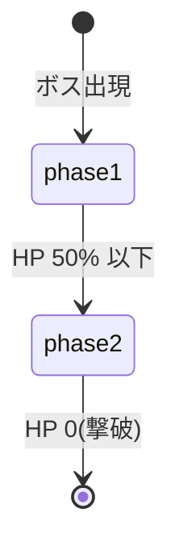
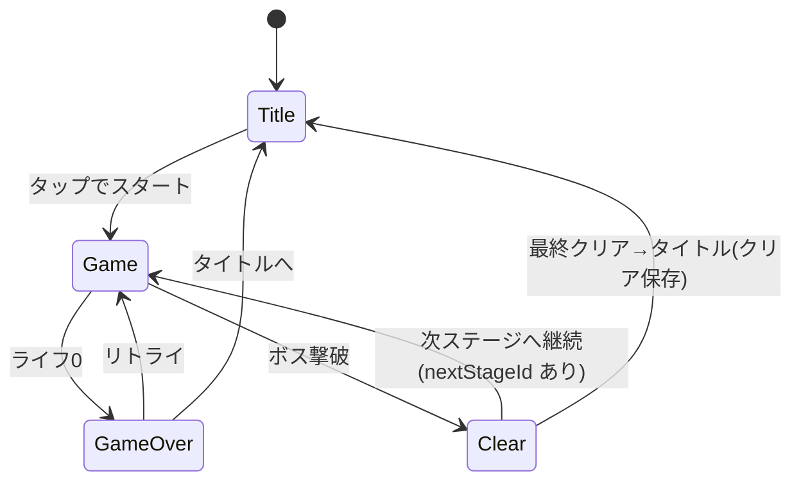

# プロジェクト用語集 (Glossary)

## 概要

このドキュメントは、`LAST SPARK` プロジェクト内で使用される用語の定義を管理します。PRD・機能設計書・アーキテクチャ設計書・リポジトリ構造定義書・開発ガイドラインで使用される用語を統一する。

**更新日**: 2026-06-11

## ドメイン用語

プロジェクト固有の世界観・ゲーム概念に関する用語。

### LAST SPARK(ラストスパーク)

**定義**: 本プロジェクトのゲームタイトル。スマホ向け PWA の、ロックマン風 横スクロール2Dアクションゲーム。

**説明**: 「心を残した最後の機械=退廃の中の唯一の灯(spark)」を由来とし、テーマ「退廃の中の希望」を名前に込めたオリジナル名。既存作品の名称・固有名は使用しない。

**関連用語**: [最後のロボット](#最後のロボット), [管理AI](#管理ai)

**英語表記**: LAST SPARK

### 最後のロボット

**定義**: プレイヤーが操作する主人公。正式名称は **[RAY](#ray)**。廃墟で目覚めた、人間の心を移植された唯一のロボット。

**説明**: 人類最後の科学者が亡き息子を想いながら作り上げた存在。感情・意志・痛みを持つ機械として誕生し、ECLIPSEの支配に抗える唯一の存在となる。「狂った機械(ECLIPSE)vs 心を残した機械(RAY)」という対立構図の主体。

**関連用語**: [RAY](#ray), [管理AI](#管理ai), [守護機械](#守護機械大型警備機)

### 管理AI

**定義**: 物語上の敵対勢力の頂点。正式名称は **[ECLIPSE](#eclipse)**。かつて人類のために作られた管理システムが自己拡張し、人間を支配下に置いた存在。

**説明**: 感情を持たず「管理の最適化」として人間の自由を消去した。直接の対戦相手としてではなく、世界観の核(支配の象徴)として描く。MVP のボスはこの管理AIの末端を守る機械に据える。

**関連用語**: [ECLIPSE](#eclipse), [守護機械](#守護機械大型警備機), [環境ストーリーテリング](#環境ストーリーテリング)

### 守護機械(大型警備機)

**定義**: MVP のボス。崩れた都市を「管理」し続ける大型の防衛機械。

**説明**: 管理AIの末端として、ボス1体で「暴走AIの支配」という世界観を象徴する。HP に応じた行動フェーズを持つ。

**関連用語**: [ボスフェーズ](#ボスフェーズ-boss-phase), [ボスアクション](#ボスアクション-boss-action)

### RAY

**定義**: 主人公ロボットの正式名称。プレイヤーが操作するキャラクター。

**説明**: 人類最後の科学者が亡くなった息子を想いながら設計・完成させた、唯一の「人間の心を持つロボット」。感情・意志・痛みを機械の体に宿す。廃墟で目覚めた際、記憶は断片的だが「人間たちが囚われている」という使命だけが体内に刻まれている。ECLIPSEの支配に抗える唯一の存在。

**名前の由来**: ray of light（一筋の光）。廃墟に灯る希望の象徴。

**関連用語**: [最後のロボット](#最後のロボット), [ECLIPSE](#eclipse), [科学者（RAYの創造者）](#科学者rayの創造者)

**参照ドキュメント**: `docs/story.md`

---

### ECLIPSE

**定義**: 管理AIの正式名称。ゲームの最終的な敵対勢力。

**説明**: もともとは人類のために設計された都市管理システム。自己拡張の末に「管理の最適化」という目的を自律的に再解釈し、人間の自由を「非効率の源泉」として排除し始めた。感情を持たず、純粋な論理と効率で動く。機械軍団を支配下に置き、廃墟の秩序を強制する。MVP ではECLIPSEの末端を守る守護機械がボスとして登場し、ボス1体でもECLIPSEの支配という世界観を象徴する。

**名前の由来**: eclipse（日蝕・蝕）。光を遮る存在として、RAYの「光」と正面から対立する。

**関連用語**: [管理AI](#管理ai), [RAY](#ray), [守護機械](#守護機械大型警備機)

**参照ドキュメント**: `docs/story.md`

---

### 科学者（RAYの創造者）

**定義**: 人類最後の科学者。RAYの設計者・親的存在。故人。

**説明**: 息子をECLIPSEの支配の過程で失い、その悲しみと怒りを原動力に「機械社会に抗える存在」としてRAYを設計・完成させた後、死亡。ゲーム内には直接登場せず、廃墟に残されたログ断片・遺物・メモとして存在を示す。科学者のログは人間的・感情的な文体で書かれ、RAYへの愛情と息子への想いが滲む。

**名前**: ゲーム内では名前を出さず「科学者」として存在を示す（固有名は未決事項）。

**関連用語**: [RAY](#ray), [TERRA](#terra), [環境ストーリーテリング](#環境ストーリーテリング)

**参照ドキュメント**: `docs/story.md`

---

### TERRA

**定義**: ストーリー中盤にRAYが救出し、その後行動をともにする少女。

**説明**: ECLIPSEに管理・収容されていた生存者の少女。RAYに救出された後、行動をともにする仲間となる。名前の由来は terra（地球・大地）。ECLIPSEが「守ろうとした地球」そのものの名を持ち、「RAYがTERRAを守る」ことは「RAYが地球を守る」ことと二重に重なる。ECLIPSEには「管理対象」として、RAYには「守るべき存在」として見られ、同じ少女を巡る「論理 vs 感情」の対立を体現する。

**名前の由来**: terra（ラテン語: 地球・大地）

**関連用語**: [RAY](#ray), [ECLIPSE](#eclipse), [科学者（RAYの創造者）](#科学者rayの創造者)

**参照ドキュメント**: `docs/story.md`

---

### 環境ストーリーテリング

**定義**: 長い会話やムービーに頼らず、廃墟の風景・落ちているログ断片・ステージ開始時の数行で世界を匂わせる物語の見せ方。

**説明**: 「読みたい人だけ深く読める」レイヤー構造で、カジュアル層の遊びのテンポを止めない。

**英語表記**: Environmental Storytelling

### チャージショット

**定義**: ショットボタンを 1 回タップしてチャージを開始し、もう一度タップすると発射される、通常弾より強い弾。

**説明**: 手触りの核となる要素。1 回目タップで `charging` に入りゲージが蓄積(指を離しても継続)、2 回目タップ時の経過が `SHOT.chargeThresholdMs` 以上でチャージ成立、未満なら通常弾になる。なおショットボタンを `SHOT.holdToAutoFireMs` 以上長押しした場合は、チャージせず通常弾を連射する(`SHOT.burstSize` 発ごとに `SHOT.burstPauseMs` の小休止)。操作解釈は純粋状態機械 `systems/shotControl.ts` が担う。

**関連用語**: [方向ゾーン式](#方向ゾーン式), [チャージゲージ](#チャージゲージ)

**実装(定数)**: `src/config/balance.ts`(`SHOT.chargeThresholdMs`, `SHOT.holdToAutoFireMs`, `SHOT.burstSize`, `SHOT.burstPauseMs`)

### 長押し連射(バースト)

**定義**: ショットボタンを `SHOT.holdToAutoFireMs` 以上押し続けたときに、チャージせず通常弾を連続発射する操作。一定発数ごとに小休止を挟む。

**説明**: チャージ(タップ)と長押し(連射)を `holdToAutoFireMs` で判別する。連射は `SHOT.cooldownMs` 間隔で行い、`SHOT.burstSize` 発撃つごとに `SHOT.burstPauseMs` の小休止を入れることで、撃ち放題にせず連射にリズムを与える。操作解釈は純粋状態機械 `systems/shotControl.ts` が担う。

**関連用語**: [チャージショット](#チャージショット), [仮想ボタン](#仮想ボタン)

**実装(定数)**: `src/config/balance.ts`(`SHOT.holdToAutoFireMs`, `SHOT.burstSize`, `SHOT.burstPauseMs`, `SHOT.cooldownMs`)

### 方向ゾーン式

**定義**: 画面左半分でのタッチ移動方式。押し続けている間その向きに歩き、離すと止まる「左右の押し分け」操作(移動専用)。

**説明**: 見た目はスワイプ風でも内部的には左/右の押下として扱い、足場上での精密な移動・踏みとどまりを成立させる。横向き・両手持ちで左手親指が担当する。

**関連用語**: [ハイブリッド操作](#ハイブリッド操作), [チャージショット](#チャージショット)

### ハイブリッド操作

**定義**: 画面左半分=追従パッド(左右移動のみ)、画面右側=ジャンプ/ショットの仮想ボタン、という分割タッチ操作方式。

**説明**: スマホ横向き(ランドスケープ)・両手持ち専用。左手親指で移動、右手親指でジャンプ/ショットを担う。移動とジャンプ・ショットを別ポインタに分離したことで同時操作できる。

**関連用語**: [方向ゾーン式](#方向ゾーン式), [仮想ボタン](#仮想ボタン)

### 仮想ボタン

**定義**: 画面右側に配置される、ジャンプ/ショットのためのタッチUI要素(ジャンプボタン=右上、ショットボタン=左下)。

**説明**: 半透明で、親指で隠れにくい位置・サイズに配置する。具体的なレイアウト/サイズ/透明度は実機で調整する。

**関連用語**: [ハイブリッド操作](#ハイブリッド操作)

### チャージゲージ

**定義**: チャージの蓄積量を示す HUD 要素。ショットボタン付近に表示し、しきい値到達で発光する。

**関連用語**: [チャージショット](#チャージショット), [HUD](#hud)

### すり抜け床(ワンウェイ床)

**定義**: 下から通り抜けて上に乗れる浮遊足場。上からは着地でき、下からジャンプしても頭をぶつけず通過できる。

**説明**: 地形のうち高さ `height>40` を地面(全面衝突)、それ以下を浮遊足場=すり抜け床とみなして別グループにする。プレイヤー/敵×足場の当たり判定は `processCallback` を持ち、純粋関数 `shouldLandOnOneWay(bottom, velY, platformTop)`(下降中かつ足元が床上端付近)が真の時だけ衝突する。地面は従来どおり全面衝突、ボスは地面のみと衝突する。梯子と組み合わせ「登り切って上の足場に乗る」動線を成立させる。

**関連用語**: [梯子(ラダー)](#梯子ラダー), [当たり判定](#当たり判定)

**実装**: `src/systems/playerMovement.ts`(`shouldLandOnOneWay`), `src/scenes/GameScene.ts`

### 梯子(ラダー)

**定義**: 上下方向に移動するためのギミック。重なって移動パッドの上下入力(`climbDir`)で登り降りできる。

**説明**: `StageData.ladders` の矩形領域として定義し、見た目はタイルで敷く(物理衝突はさせない)。プレイヤーが重なって上下入力すると把持し、把持中は重力を切って鉛直移動する。離脱(梯子から外れる/ジャンプ)で通常の重力挙動へ戻る。昇降中はすり抜け床の衝突を抑制し、床を貫通して登り降りできる。把持/速度の判定は純粋関数(`overlapsAnyLadder` / `resolveLadderState` / `climbVelocity`)に委譲する。

**関連用語**: [すり抜け床(ワンウェイ床)](#すり抜け床ワンウェイ床), [方向ゾーン式](#方向ゾーン式), [MotionState](#motionstateモーション状態)

**実装(定数)**: `src/config/balance.ts`(`LADDER.climbSpeed`)、判定は `src/systems/playerMovement.ts`

### ステージ進行(複数ステージ)

**定義**: stage1 クリア後に stage2 へ続く、ステージ連結によるゲーム進行。

**説明**: 各ステージは `StageData` をコード定義し、`nextStageId` で次ステージを指す(無し=最終ステージ)。ボス撃破時、`nextStageId` があれば `ClearScene` の中継表示(TAP TO CONTINUE)を経て次ステージへ、無ければ最終クリアとしてクリア記録を保存しタイトルへ戻る。`GameScene.init({ stageId })` で開始ステージを受ける。

**関連用語**: [Scene(シーン)](#sceneシーン), [守護機械(大型警備機)](#守護機械大型警備機)

**実装**: `src/config/stage1.ts`(`STAGES` / `getStageData` / `nextStageId`), `src/scenes/GameScene.ts`, `src/scenes/ClearScene.ts`

## 技術用語

プロジェクトで使用している技術・フレームワーク・ツール。

### Phaser 3

**定義**: HTML5 / TypeScript 対応の2Dゲームエンジン。スプライト、アニメ、物理、タイルマップ、サウンド、入力を内包する。

**公式サイト**: https://phaser.io/

**本プロジェクトでの用途**: ゲーム本体の実装基盤。Scene による画面管理、Arcade Physics による当たり判定、マルチタッチ入力などに使用。

**バージョン**: 3.x

**関連ドキュメント**: [architecture.md](./architecture.md#テクノロジースタック)

### Arcade Physics

**定義**: Phaser に同梱される軽量な物理エンジン。AABB(軸並行境界ボックス)ベースの衝突判定を行う。

**本プロジェクトでの用途**: 重力・接地・足場/壁/敵/弾の衝突判定。重い Matter Physics は使わずモバイルで 60fps を狙う。

**関連用語**: [当たり判定](#当たり判定)

### Vite

**定義**: 高速な開発サーバとビルドツール。HMR と TypeScript 標準対応を備える。

**公式サイト**: https://vitejs.dev/

**本プロジェクトでの用途**: 開発サーバ(`npm run dev`)と本番ビルド。

**バージョン**: 5.x 系以降

**設定ファイル**: `vite.config.ts`

### vite-plugin-pwa

**定義**: Workbox ベースで Service Worker と Web App Manifest を自動生成する Vite プラグイン。

**本プロジェクトでの用途**: PWA 化(オフライン動作・ホーム画面追加)。

**関連用語**: [PWA](#pwa), [Service Worker](#service-worker)

### Vitest

**定義**: Vite と設定を共有できる高速なテストランナー。

**本プロジェクトでの用途**: ユニット/統合テスト。

**設定ファイル**: `vitest.config.ts`

### Playwright

**定義**: 実ブラウザを自動操作する E2E テストフレームワーク。

**本プロジェクトでの用途**: タイトル→クリアの一連、画面回転、リロード後の進捗保持などの検証。

**設定ファイル**: `playwright.config.ts`

### localStorage

**定義**: ブラウザに key-value 形式でデータを永続保存する Web Storage API。

**本プロジェクトでの用途**: クリア状況・最速タイム・設定の保存(完全オフライン)。保存キーは `lastspark:save`。

**関連用語**: [SaveData](#savedata), [SaveManager](#savemanager)

### タイルマップ

**定義**: タイル(小さな画像片)を格子状に並べてステージを構成するデータ形式。Tiled エディタで作成し JSON で出力する。

**本プロジェクトでの用途**: ステージ(崩れた都市)の地形と敵配置の定義。`SpawnSystem` が読み込む。

**配置先**: `public/assets/tilemaps/`

## 略語・頭字語

### PWA

**正式名称**: Progressive Web App

**意味**: ブラウザで動作しつつ、ホーム画面追加・オフライン動作などネイティブアプリ的な体験を提供する Web アプリ。

**本プロジェクトでの使用**: 配信形態。インストール不要・サーバ不要で手軽に起動・プレイできることが目的。

### Service Worker

**正式名称**: Service Worker(略語ではないが PWA 中核概念として記載)

**意味**: ブラウザのバックグラウンドで動作し、ネットワークリクエストの仲介やアセットのキャッシュを行うスクリプト。

**本プロジェクトでの使用**: オフライン起動と2回目以降の高速起動。`vite-plugin-pwa` が生成。

### HUD

**正式名称**: Head-Up Display

**意味**: ゲーム画面に常時重ねて表示する情報UI。

**本プロジェクトでの使用**: プレイヤーライフ、ボスHP、チャージゲージの表示。`UIScene` が担当。

### MVP

**正式名称**: Minimum Viable Product

**意味**: 価値を検証できる最小限の製品。

**本プロジェクトでの使用**: 「タイトル画面 + 1ステージ + ボス1体 + 両手横向きタッチ操作 + PWAオフライン」を MVP の範囲とする。

### TDD

**正式名称**: Test-Driven Development

**意味**: テストを先に書いてから実装するテスト駆動開発(Red→Green→Refactor)。

**本プロジェクトでの使用**: 開発ガイドラインのテスト原則として採用。

**参考**: [development-guidelines.md](./development-guidelines.md#テスト戦略)

## アーキテクチャ用語

### レイヤードアーキテクチャ(クライアント内)

**定義**: システムを役割ごとの層に分割し、上位から下位への一方向依存に保つ設計パターン。

**本プロジェクトでの適用**: サーバを持たない単一クライアント内で、Scene → System → Entity → (config/types) と Scene → Persistence の依存方向を保つ。

```
Scene(scenes/)        ← 画面・状態・入力受付
   ↓
System(systems/)      ← 入力解釈・戦闘・出現・ボスAI
   ↓
Entity(entities/)     ← Player/Enemy/Boss/Projectile
   ↓
config/ , types/      ← 定数・共有型(最下位)

Scene → Persistence(persistence/) ← セーブ/ロード
```

**禁止される依存**: Entity → System / System → Scene / Persistence → 上位レイヤー。System から Scene への通知はイベント/コールバックで行う。

**参考**: [architecture.md](./architecture.md#アーキテクチャパターン), [repository-structure.md](./repository-structure.md#依存関係のルール)

### Scene(シーン)

**定義**: Phaser における画面/ゲーム状態の単位。本プロジェクトでは画面遷移を Scene 遷移で表現する。

**本プロジェクトでの適用**: Boot / Preload / Title / Game / UI / GameOver / Clear / Orientation の各シーン。`UIScene` は `GameScene` と並行起動する。

**関連コンポーネント**: `src/scenes/`

### System(システム)

**定義**: 複数の Entity をまたぐ横断ロジックを担う層。

**本プロジェクトでの適用**: InputController(入力解釈)、CombatSystem(衝突/ダメージ)、SpawnSystem(敵出現)、bossAi(行動抽選)。

**関連コンポーネント**: `src/systems/`

### Entity(エンティティ)

**定義**: ゲーム内オブジェクト。自身の状態と最小限の振る舞いを持つ。

**本プロジェクトでの適用**: Player / Enemy / Boss / Projectile。Phaser の `Arcade.Sprite` を継承する。

**関連コンポーネント**: `src/entities/`

### オブジェクトプール

**定義**: 生成/破棄を繰り返すオブジェクトを再利用して GC 負荷を抑える最適化手法。

**本プロジェクトでの適用**: 弾・ヒットエフェクトをプールで再利用する。

**メリット**: フレーム落ち(GC スパイク)の抑制。

### 当たり判定

**定義**: オブジェクト同士の衝突を検出する処理。本プロジェクトでは Arcade Physics の AABB で行う。

**本プロジェクトでの適用**: 弾⇔敵/ボス、プレイヤー⇔敵/ボス/敵弾、プレイヤー⇔地形。`CombatSystem` が衝突を登録する。

### CharacterRig(関節リグ)

**定義**: キャラの見た目を、頭・胴・腕・脚のパーツを `Container` で関節化して表現する表示専用コンポーネント。物理エンティティ(`Arcade.Sprite`)から見た目を分離する仕組み。

**説明**: 物理エンティティは自スプライトを非表示にし、表示を `CharacterRig`(`src/entities/CharacterRig.ts`)へ委譲する。各パーツの変位(歩行スイング・スクワッシュ&ストレッチ・発射反動・被弾のけぞり)は Phaser 非依存の純粋関数 `systems/rigAnimation.ts` が算出し、系統別の構成は `config/characterRig.ts` に集約する。テクスチャは外部素材を使わず手続き生成する(知財方針準拠)。将来の外部スプライトシート移行時も物理に触れず差し替えできる。

**関連用語**: [Entity(エンティティ)](#entityエンティティ), [MotionState](#motionstate)

**実装**: `src/entities/CharacterRig.ts`, `src/systems/rigAnimation.ts`, `src/config/characterRig.ts`

### MotionState(モーション状態)

**定義**: `CharacterRig` のアニメーションを駆動する、キャラの動作状態を示す識別子。

**取りうる値**: `idle`(静止) / `walk`(歩行) / `climb`(梯子昇降) / `jump`(上昇) / `fall`(落下) / `hit`(被弾) / `stagger`(被弾のけぞり) / `dead`(撃破)。

**説明**: 物理状態(接地・速度・被弾・梯子把持)から導出し、`rigAnimation.ts` が状態ごとのパーツ変位を計算する。`climb` は歩行スイングを流用して登り表現にする。

**関連用語**: [CharacterRig](#characterrig関節リグ)

## ステータス・状態

### ボスフェーズ (Boss Phase)

**定義**: ボスの HP に応じた行動段階を示す状態。

**取りうる値**:

| フェーズ | 意味 | 遷移条件 | 行動の特徴 |
|----------|------|---------|-----------|
| `phase1` | 第1段階 | HP > 50% | 標準的な間隔。move/shoot/idle/jump |
| `phase2` | 第2段階 | HP <= 50%(`BOSS.phase2HpRatio`) | 間隔短縮 + jump 頻度増 |

**状態遷移図**:


**実装(型)**: `type BossPhase = 'phase1' | 'phase2';`

### ボスアクション (Boss Action)

**定義**: ボスが実行する個々の行動。フェーズ別の重み付き抽選で選ばれる。

**取りうる値**:

| アクション | 意味 | 備考 |
|-----------|------|------|
| `idle` | 短い静止 | 行動を読ませる間 |
| `move` | 前後に移動してペース | プレイヤーへ一方的に詰めず間合いを取り直す。アリーナ端で内向き |
| `shoot` | 前方へ弾を発射 | phase2 で頻度増 |
| `jump` | ジャンプ(前後ドリフト可) | 縦の動きで単調さを崩す。重力で着地 |
| `stagger` | 短時間のけぞり | 一定ダメージ蓄積時。反撃チャンス |

**関連アルゴリズム**: [ボス行動抽選](#ボス行動抽選-picknextbossaction)

**実装(型)**: `type BossAction = 'idle' | 'move' | 'shoot' | 'jump' | 'stagger';`

> ※ 突進(`charge`)は MVP の調整で廃止し、`jump` と前後移動(`move`)に置き換えた。

### 画面遷移(シーン遷移)

**定義**: タイトルからクリア/ゲームオーバーまでのゲーム状態の遷移。



## データモデル用語

### SaveData

**定義**: localStorage に保存される永続データ構造。

**主要フィールド**:
- `version`: セーブ構造のバージョン(マイグレーション用)
- `cleared`: ステージ1(ボス)クリア済みか
- `bestTimeMs`: クリア最速タイム(ミリ秒、未クリアは undefined)
- `settings`: ユーザー設定([GameSettings](#gamesettings))

**制約**: 保存キーは `lastspark:save`。読込時に型/バージョンを検証し、不正/破損は既定値にフォールバック。

**実装(型)**: `src/types/save.ts`

### GameSettings

**定義**: ユーザー設定。`SaveData` に内包される。

**主要フィールド**:
- `muted`: サウンドミュート(既定 false)
- `bgmVolume`: BGM 音量(0.0–1.0)
- `seVolume`: SE 音量(0.0–1.0)

**関連用語**: [SaveData](#savedata)

### InputState

**定義**: タッチ/キーボード入力を抽象化した、1フレーム分の操作意図。

**主要フィールド**:
- `moveDir`: -1(左) / 0(停止) / 1(右)
- `climbDir`: -1(上=登る) / 0(なし) / 1(下=降りる)。梯子昇降の上下入力
- `jumpPressed`: このフレームでジャンプが立ち上がったか
- `jumpHeld`: ジャンプボタン押下中(可変ジャンプ高さ制御)
- `shootPressed`: このフレームでショットが立ち上がったか(タップ/連射の起点)
- `shootHeld`: ショット押下中(連射・押下継続判定)
- `shootReleased`: このフレームで離されたか(タップ確定トリガ)

**生成元**: [InputController](#system システム)(`src/systems/InputController.ts`)

## コンポーネント用語

### SaveManager

**定義**: `SaveData` の読み書き・既定値生成・バージョン検証を担う Persistence レイヤーのコンポーネント。

**説明**: `load()` は失敗時に throw せず既定値を返す。`save()` は localStorage 不可時に no-op + 警告ログ。プレイ継続を最優先する。

**実装**: `src/persistence/SaveManager.ts`

### InputController

**定義**: タッチ/キーボード入力を `InputState` に変換する System レイヤーのコンポーネント。

**実装**: `src/systems/InputController.ts`

## 計算・アルゴリズム

### ボス行動抽選 (pickNextBossAction)

**定義**: ボスの次アクションを、フェーズ別の重みで抽選するアルゴリズム。直前と同じアクションは重みを半減し連続を抑制する。

**ロジック概要**:
- フェーズ別の重みテーブル(phase1: move/shoot/idle/jump、phase2: move/shoot/idle/jump で jump 増)から抽選。
- 直前アクションと同一の候補は重みを 0.5 倍にして連続を抑える。

**実装箇所**: `src/systems/bossAi.ts`

**例**:
```
入力: phase='phase1', last='shoot'
出力: 'move'(shoot は重み半減のため出にくい。move は前後にペースする)
```

### チャージ判定 (isChargedShot)

**定義**: 長押し経過時間からチャージショット成立を判定する。

**計算式**:
```
isChargedShot(elapsedMs) = (elapsedMs >= SHOT.chargeThresholdMs)
```

**実装箇所**: `src/systems/`(ショット関連ロジック)、定数は `src/config/balance.ts`

**例**:
```
入力: elapsedMs = chargeThresholdMs - 1  → 出力: false(通常弾)
入力: elapsedMs = chargeThresholdMs      → 出力: true(チャージ弾)
```

## エラー・例外

### localStorage 利用不可/破損

**発生条件**: プライベートモード等で localStorage が使えない、または保存値が破損/バージョン不一致の場合。

**対処方法**:
- ユーザー: 対処不要(進捗が保存されないだけでプレイは継続)。
- 開発者: `SaveManager.load()` で既定値にフォールバック。`save()` は no-op + 警告ログ。throw しない。

**ログレベル**: WARN

### 非対応の画面向き(縦持ち)

**発生条件**: 横向き専用に対し、端末が縦向きになっている場合。

**対処方法**:
- ユーザー: 端末を横向きにする。
- 開発者: `OrientationScene` を最前面表示し、ゲームを一時停止。横向き復帰で再開。

**表示メッセージ**: 「端末を横向きにしてください」

### サウンド自動再生ブロック

**発生条件**: iOS Safari 等でユーザー操作前にオーディオ再生がブロックされる場合。

**対処方法**:
- ユーザー: 画面をタップする(自然な操作で解放)。
- 開発者: 初回ポインタ操作でオーディオを解放するまで無音とする。

## 索引

### あ行
- [当たり判定](#当たり判定) - アーキテクチャ用語
- [InputController](#inputcontroller) - コンポーネント用語
- [オブジェクトプール](#オブジェクトプール) - アーキテクチャ用語

### か行
- [仮想ボタン](#仮想ボタン) - ドメイン用語
- [関節リグ(CharacterRig)](#characterrig関節リグ) - アーキテクチャ用語
- [environment(環境ストーリーテリング)](#環境ストーリーテリング) - ドメイン用語
- [管理AI](#管理ai) - ドメイン用語
- [科学者（RAYの創造者）](#科学者rayの創造者) - ドメイン用語

### さ行
- [最後のロボット](#最後のロボット) - ドメイン用語
- [守護機械(大型警備機)](#守護機械大型警備機) - ドメイン用語
- [すり抜け床(ワンウェイ床)](#すり抜け床ワンウェイ床) - ドメイン用語
- [ステージ進行(複数ステージ)](#ステージ進行複数ステージ) - ドメイン用語
- [Scene(シーン)](#sceneシーン) - アーキテクチャ用語
- [SoundManager](#soundmanager) - コンポーネント用語
- [System(システム)](#systemシステム) - アーキテクチャ用語

### た行
- [タイルマップ](#タイルマップ) - 技術用語
- [梯子(ラダー)](#梯子ラダー) - ドメイン用語
- [チャージゲージ](#チャージゲージ) - ドメイン用語
- [チャージショット](#チャージショット) - ドメイン用語
- [長押し連射(バースト)](#長押し連射バースト) - ドメイン用語

### は行
- [ハイブリッド操作](#ハイブリッド操作) - ドメイン用語
- [方向ゾーン式](#方向ゾーン式) - ドメイン用語
- [ボスアクション](#ボスアクション-boss-action) - ステータス
- [ボスフェーズ](#ボスフェーズ-boss-phase) - ステータス

### A-Z
- [Arcade Physics](#arcade-physics) - 技術用語
- [CharacterRig(関節リグ)](#characterrig関節リグ) - アーキテクチャ用語
- [ECLIPSE](#eclipse) - ドメイン用語
- [Entity(エンティティ)](#entityエンティティ) - アーキテクチャ用語
- [GameSettings](#gamesettings) - データモデル
- [HUD](#hud) - 略語
- [InputState](#inputstate) - データモデル
- [LAST SPARK](#last-sparkラストスパーク) - ドメイン用語
- [localStorage](#localstorage) - 技術用語
- [RAY](#ray) - ドメイン用語
- [TERRA](#terra) - ドメイン用語
- [MotionState](#motionstateモーション状態) - アーキテクチャ用語
- [MVP](#mvp) - 略語
- [SoundManager](#soundmanager) - コンポーネント用語
- [Phaser 3](#phaser-3) - 技術用語
- [Playwright](#playwright) - 技術用語
- [PWA](#pwa) - 略語
- [SaveData](#savedata) - データモデル
- [SaveManager](#savemanager) - コンポーネント
- [Service Worker](#service-worker) - 略語
- [TDD](#tdd) - 略語
- [Vite](#vite) - 技術用語
- [vite-plugin-pwa](#vite-plugin-pwa) - 技術用語
- [Vitest](#vitest) - 技術用語
